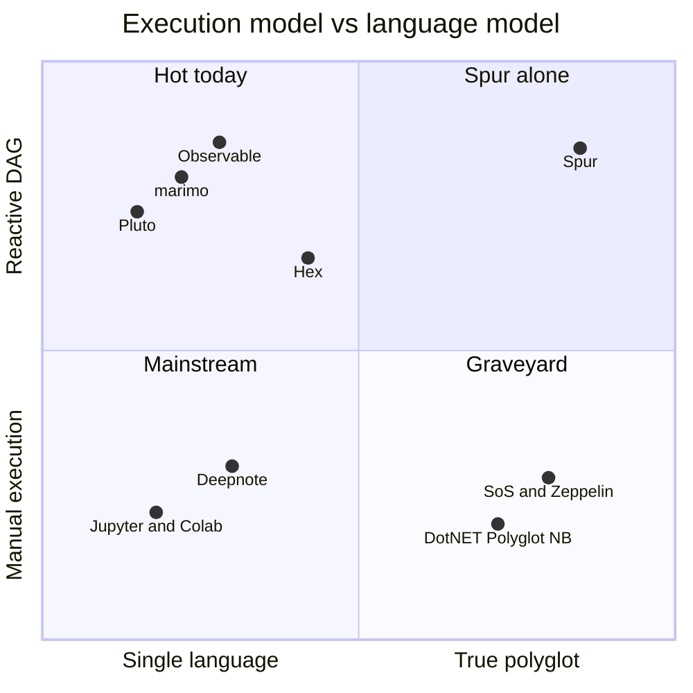
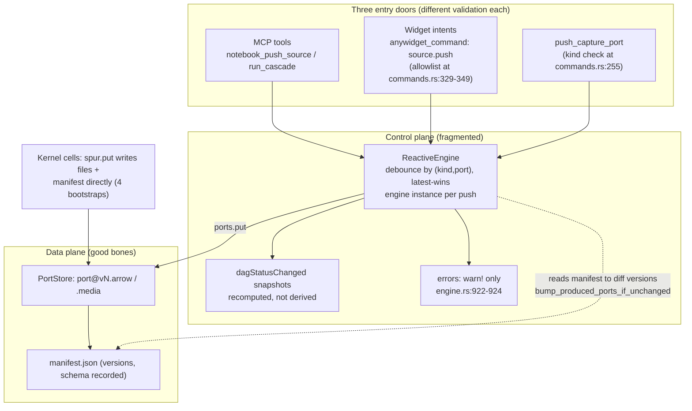
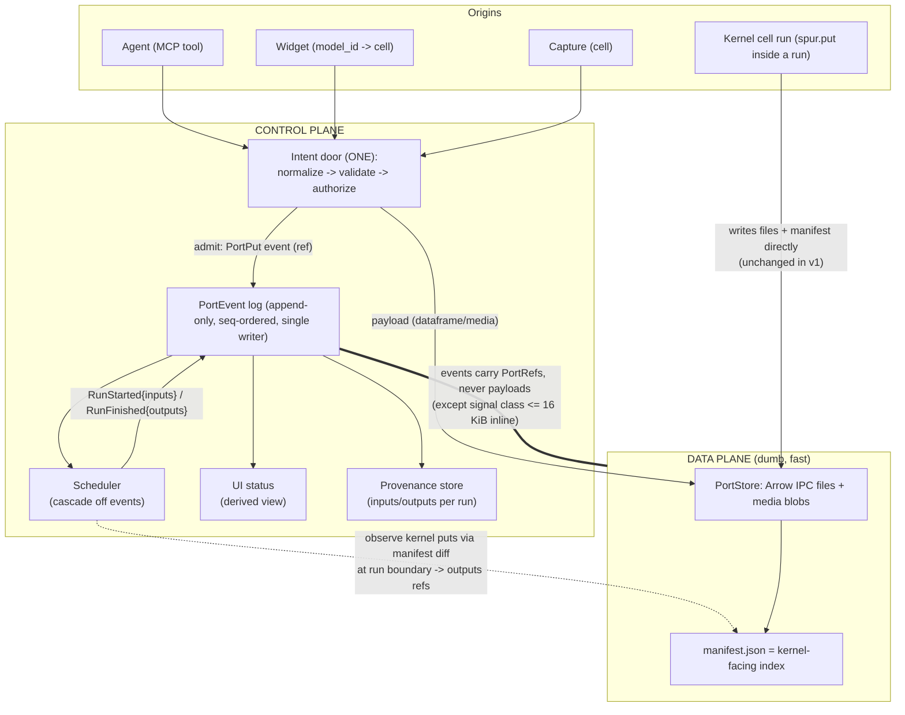
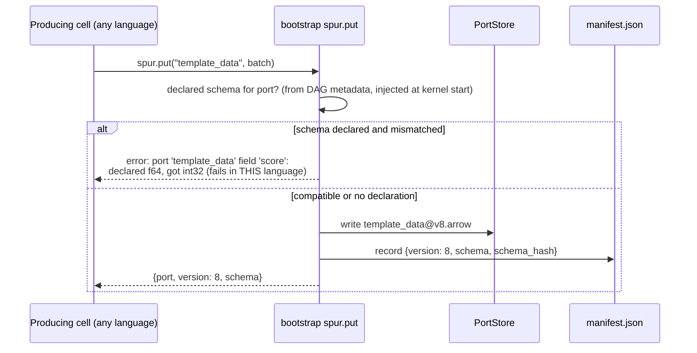
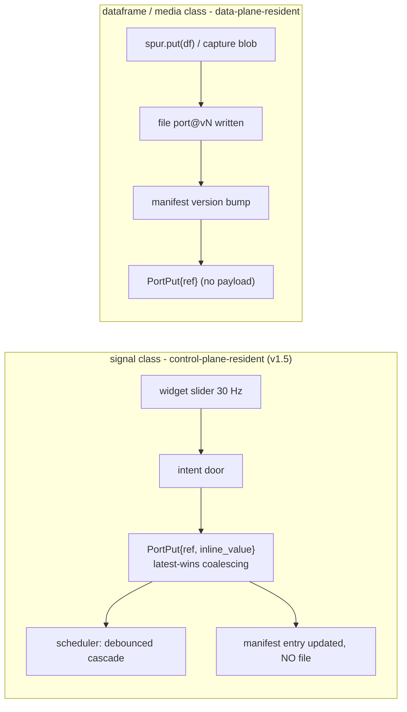
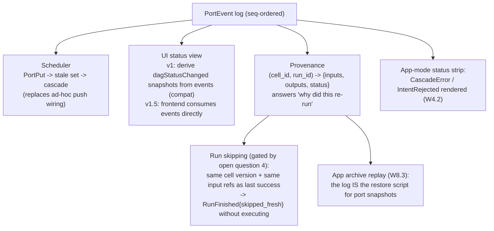
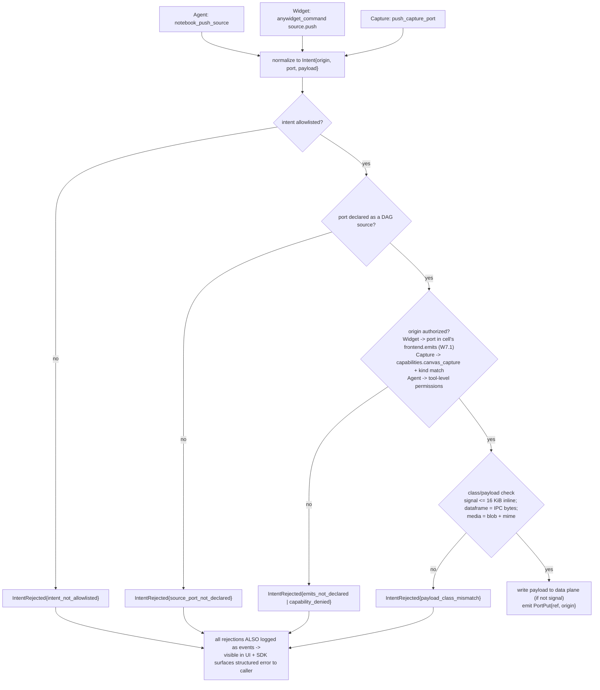
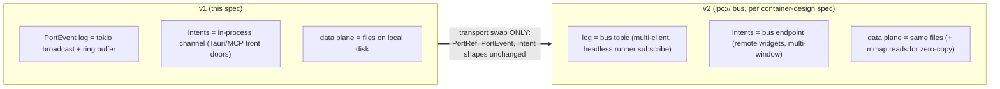

# Port Plane Integration v1 — Unifying the Control Plane and Data Plane

**Date:** 2026-06-11
**Status:** Draft v1.1 — revised 2026-06-11 after grounding review (`signal` class moved to
v1.5, event-sink ownership defined in §6.2, input-capture algorithm added in §6.6, I2 write
mechanics specified in §8, run-skipping gated behind §12 Q4)
**Related:**
- `docs/superpowers/specs/2026-06-01-jute-app-notebook-as-application-container-design.ipynb`
  (three layers, frontend cells, reactive loop; §8 supervision; `ipc://` bus designed, deferred)
- `docs/superpowers/specs/2026-06-10-app-platform-contract-design.ipynb`
- `docs/superpowers/specs/2026-06-10-spur-app-sdk-design.ipynb`
- `docs/research/sdk-dx-benchmark-curation.md` (work items W1–W9 referenced below)

---

## 1. Summary

Spur's polyglot notebook bet — Python/JS/Rust/Go cells as interchangeable lego blocks connected
by Arrow ports, authored primarily by AI agents — is competitively unique (the
reactive × polyglot × app quadrant is otherwise empty) but only defensible if the *seams between
cells* are machine-checkable. A human polyglot author held the cross-language contract in their
head; an agent-authored notebook has no head to hold it in.

Today the **data plane** (Arrow IPC port files + manifest) has good bones, while the **control
plane** (scheduling, intents, status, errors) is fragmented across three entry doors, two exit
paths, and zero provenance. This spec unifies them with three primitives and two discipline
rules:

1. **`PortRef`** — `(port, version, class, schema)` — the standardized lego stud. Schema is
   *declared* (optionally) and validated at `put`, so cross-language type errors surface in the
   producing language.
2. **`PortEvent` log** — one append-only, strictly-ordered event stream that the scheduler, the
   UI, and provenance all derive from. The manifest becomes the data-plane index; the log
   becomes the control-plane truth.
3. **Intent door** — one validated entry path for all external writes (agent MCP tools, widget
   intents, canvas capture), with declared-`emits` authorization.

Rules: **control messages carry refs, not payloads** (except a small `signal` class, deferred
to v1.5 — see §5.3), and **the data plane stays dumb**. Together these make the eventual `ipc://` bus a transport swap,
not a redesign.

## 2. Motivation

### 2.1 The competitive thesis

Languages are primitives. With an agent authoring cells, the per-language cognitive load that
killed every previous polyglot notebook (BeakerX dead, SoS academic, Zeppelin declining)
disappears — the agent picks Rust for the hot loop, Go for the client library, Python for ML,
Deno for the frontend, per cell, at near-zero human cost. What remains — and grows — is the
cost of the seams. The integration of control and data plane IS the product surface that makes
"different language per cell, same notebook" trustworthy.



Why the previous polyglot generation failed technically: ambient variable sharing through a hub
language (`%get/%put`, `#!share`, `z.put/z.get`, autotranslation) — lossy per-type mappings, no
contract, no graph semantics. Spur already avoided that trap (Arrow interchange, explicit named
ports, real processes per language). This spec finishes the job on the control side.

### 2.2 Why agents raise the bar on the seams

| Human-authored notebook | Agent-authored notebook |
|---|---|
| Author remembers what each cell produces | Nothing remembers; the contract must be declared |
| Type mismatch debugged by reading both cells | Must fail at the *write* site, in the writer's language |
| "Why did this re-run?" answered by intuition | Must be answerable from recorded provenance |
| One pair of eyes on one entry path | Three entry doors used concurrently (agent, widget, capture) |

## 3. Current state and seam gaps

### 3.1 The two planes today



### 3.2 Seam gaps (evidence)

| # | Gap | Evidence | Consequence |
|---|---|---|---|
| G1 | Runs don't record consumed port versions | `dagStatus.ts:74` TODO(t5); `RunStarted` has no inputs concept | No provenance, no sound caching, no "why did this re-run" |
| G2 | `emits` is advisory | `handle_source_push_intent` checks only port-declared-anywhere (`commands.rs:358`) | Any widget can push to any declared port; untenable for third-party apps |
| G3 | Cascade errors invisible | `warn!` only (`engine.rs:922-924`) | Dominant debugging experience is "nothing happened" (W4.2 approved) |
| G4 | Schemas recorded, never declared | manifest stores observed schema; no declaration in DAG metadata | Cross-language type error surfaces at `get` in the wrong language; Rust bootstrap rejects Timestamp/Decimal/Dictionary (`ports_bootstrap.rs:265`) that Python/JS/Go accept |
| G5 | One QoS class for all writes | every put = versioned file write | Right for dataframes, wrong for a 30 Hz slider; no streaming story |
| G6 | Three doors, three validation paths | §3.1 diagram | Audit/grants incoherent; the pilot app wraps `source.push` in `catch (_) {}` |
| G7 | Status recomputed, not derived | `emit_dag_status_changed` rebuilds snapshot from store + manifest re-read (`engine.rs:597-615`) | No single ordering; UI and scheduler can disagree transiently |
| G8 | Port snapshot restore unimplemented | `spur_app.rs:415` | App archives bundle data that silently doesn't restore (W8.3) |

## 4. Design overview



The two discipline rules (borrowed from networking, validated by Ray's
ObjectRef-plus-plasma-store split):

- **R1 — refs, not payloads.** Control messages reference data as `port@version`. The only
  exception is the `signal` port class with inline payloads under a fixed threshold.
- **R2 — dumb data plane.** `PortStore` does write/read/version, nothing else. All intelligence
  lives in event-log consumers, so transports and storage can evolve independently.

## 5. Primitive 1 — `PortRef` and port classes

### 5.1 Shape

```rust
struct PortRef {
    port: String,
    version: u64,
    class: PortClass,            // Dataframe | Media | Signal
    schema_hash: Option<String>, // present when a schema is declared for the port
}

enum PortClass { Dataframe, Media, Signal }
```

`port@version` is immutable once written (invariant I2). A ref is simultaneously a control-plane
handle and a data-plane locator — the Ray ObjectRef property that lets control messages stay
payload-free.

### 5.2 Declared schemas (the typed stud)

DAG metadata gains an optional, additive declaration (no change for existing notebooks):

```jsonc
{
  "produces": [{
    "port": "template_data",
    "repr": "arrow",
    "class": "dataframe",                       // default: dataframe
    "schema": {                                  // OPTIONAL — Arrow schema JSON,
      "fields": [                                // same dialect the manifest already records
        { "name": "id",    "type": "utf8" },
        { "name": "score", "type": "f64" }
      ]
    }
  }]
}
```

Validation happens **at `put`, in the producing process**: the bootstrap (or, in v1, the
host-side put path for pushes — see §6.4 for the kernel-write caveat) compares the written batch
schema to the declaration and fails with the port name, the offending field, and both types.
A Go cell writing `int32` where `f64` is declared fails *in the Go cell*, not three cells later
in Python. Conformance fixtures in `sdk/fixtures/` pin the type mapping across all four
bootstraps (closes the G4 asymmetry as a tested contract).



### 5.3 Port classes (the G5 fix)

| Class | Payload location | Write cost | Coalescing | Intended use |
|---|---|---|---|---|
| `dataframe` | Arrow IPC file `port@vN.arrow` | file write per version | debounce (existing) | datasets, tables, derived results |
| `media` | blob file `port@vN.media` | file write | none | capture WebM, images, audio |
| `signal` *(v1.5)* | **inline in the `PortPut` event**, ≤ 16 KiB | none (no file) | latest-wins per port | sliders, selections, cursors, heartbeats |

**`signal` is deferred to v1.5 — it is not additive under the current manifest wire contract.**
`PortEntry` requires `path` and accepts only `arrow`/`media` kinds (`ports.rs:161-197`),
`PortStore::get` is file-backed (`ports.rs:350`), and all four bootstraps parse the manifest
with the same assumptions. A manifest entry carrying an inline value with no file is therefore
a wire-format revision, which would contradict I4's "no kernel/bootstrap changes in v1" if
shipped silently. So: **v1 accepts `dataframe` and `media` only**; `PortClass::Signal` stays
reserved in the enum so `PortRef`/event shapes don't change later. v1.5 lands signal as an
explicit, versioned change: manifest entries gain `kind: "signal"` with an inline value and no
`path`, `PortStore::get` and all four bootstrap parsers learn the kind behind shared
conformance fixtures, and only then does `spur.get` work uniformly across classes. Signal ports
keep monotonic versions; the threshold (16 KiB initial) is an invariant-guarded constant, not a
convention.



## 6. Primitive 2 — the `PortEvent` log

### 6.1 Event types

```rust
struct PortEvent { seq: u64, at_ms: u64, kind: PortEventKind }

enum PortEventKind {
    PortPut        { r#ref: PortRef, origin: Origin,
                     inline_value: Option<Vec<u8>> },          // signal class only (v1.5)
    CascadeStarted { cascade_id: u64, trigger: Origin },
    RunStarted     { cascade_id: u64, run_id: u64, cell_id: String,
                     inputs: Vec<RunInput> },                   // closes t5 / G1; algorithm §6.6
    RunFinished    { cascade_id: u64, run_id: u64, cell_id: String,
                     status: RunStatus,                         // succeeded | failed |
                     outputs: Vec<PortRef> },                   //   upstream_failed | stale |
                                                                //   skipped_fresh (gated, §10)
    CascadeFinished{ cascade_id: u64, status: CascadeStatus },
    CascadeError   { cascade_id: u64, code: String, message: String,
                     port: Option<String> },                    // W4.2
    IntentRejected { origin: Origin, code: String, port: String }, // W7.1 visibility
}

struct RunInput {
    port: String,
    r#ref: Option<PortRef>,   // None = declared input never written (see §6.6 step 3)
}

enum Origin {
    Agent   { tool: String },
    Widget  { model_id: String, cell_id: String },
    Capture { cell_id: String },
    Kernel  { cell_id: String },
}
```

### 6.2 Ordering and ownership

"Single writer" needs a concrete owner, because today there is no single engine task: the
dispatcher in `spawn_reactive_engine` spawns an **independent cascade task per drained push**
(`engine.rs:900-926`), each with its own `ReactiveEngine` instance, and failures inside those
tasks are `warn!`-only (`engine.rs:922-924`).

The owner is a dedicated **sequencer task** spawned alongside the dispatcher. It holds the only
append handle to the log; `seq` is assigned inside the sequencer on receipt — never by
emitters. Every emitter — each spawned cascade task, the intent door, the capture path — holds
a cloned `mpsc::Sender<PortEventDraft>` (a `PortEvent` minus `seq`/`at_ms`). Cascade processing
stays spawned-per-push exactly as today; **only emission centralizes**.

Ordering guarantees follow from tokio mpsc semantics: per-sender FIFO means each cascade's
events arrive in program order; events from concurrent cascades interleave by arrival at the
sequencer, which is acceptable because `cascade_id` correlates each cascade's stream. The
cascade task's error arm sends `CascadeError` through the same sink — replacing the
`warn!`-only path and establishing I1 are the same change (the same discipline `SpurEvent.seq`
already enforces in `spur-core`).

v1 transport: the sequencer appends to a bounded in-memory ring and fans out via
`tokio::sync::broadcast` for late subscribers; persistence is an open question (§12), not a v1
requirement.

### 6.3 Consumers — one log, three views



The existing `dagStatusChanged` snapshot stays in v1 as a *derived emission* (no frontend
breakage); the recomputation path in `emit_dag_status_changed` (`engine.rs:597-615`) is replaced
by event-fold. G7 closes because both scheduler and UI now observe the same ordered stream.

### 6.4 Observing kernel-side puts (honest caveat)

Kernel cells write port files and update `manifest.json` directly from their own process (all
four bootstraps). In v1 the host does **not** intercept those writes in real time; it observes
them **at run boundaries** by diffing manifest versions — the mechanism
`bump_produced_ports_if_unchanged` already uses — and synthesizes the `outputs: Vec<PortRef>` on
`RunFinished`. This is sufficient because kernel puts only happen inside runs; everything
outside a run (widget, agent, capture) flows through the intent door and gets a real-time
`PortPut`. The division is clean:

- **Inside a run** → observed at the boundary → `RunFinished.outputs`.
- **Outside a run** → intent door → immediate `PortPut`.

### 6.5 Full cascade lifecycle

```mermaid
sequenceDiagram
    participant W as Widget
    participant ID as Intent door
    participant LOG as PortEvent log
    participant SCH as Scheduler
    participant K1 as Python cell (consumer)
    participant K2 as Deno view cell
    participant UI as App-mode UI

    W->>ID: source.push {port: "template_selection", payload}
    ID->>ID: validate (allowlist, declared, emits, class)
    ID->>LOG: PortPut{template_selection@v4, origin: Widget}
    LOG-->>SCH: (subscribed)
    SCH->>LOG: CascadeStarted{c7, trigger: Widget}
    SCH->>LOG: RunStarted{c7, r1, cell: transform, inputs: [template_selection@v4, template_search@v2]}
    SCH->>K1: run cell
    K1->>K1: spur.put("template_data", df)  // writes file + manifest v9
    K1-->>SCH: succeeded
    SCH->>LOG: RunFinished{c7, r1, transform, succeeded, outputs: [template_data@v9]}
    SCH->>LOG: RunStarted{c7, r2, cell: preview, inputs: [template_data@v9]}
    SCH->>K2: run cell
    K2-->>SCH: succeeded
    SCH->>LOG: RunFinished{c7, r2, preview, succeeded, outputs: []}
    SCH->>LOG: CascadeFinished{c7, succeeded}
    LOG-->>UI: derived status: fresh; provenance recorded
    Note over LOG,UI: failure path: any error -> CascadeError{c7, code, message}<br/>-> status strip (W4.2). Nothing is warn!-only anymore.
```

### 6.6 Capturing `RunStarted.inputs` (algorithm)

Today the engine snapshots only **produced** versions around a run (`produced_port_versions`,
`engine.rs:617`; `bump_produced_ports_if_unchanged`, `engine.rs:643`); nothing records what a
run consumed. The capture algorithm:

1. **Derive the input set from graph metadata.** A cell's input ports are its `consumes` list
   in the resident graph (`graph.rs:143`) — the same metadata the scheduler topo-sorts on, so
   the recorded inputs can never disagree with scheduling.
2. **Resolve immediately before dispatch.** After the cell's upstream runs in the cascade have
   finished and just before the cell is dispatched, read the manifest once
   (`PortStore::open_read_only_at`) and resolve each consumed port to a
   `PortRef { port, version, class, schema_hash }`.
3. **Missing port** (declared input never written): record `RunInput { port, ref: None }`. The
   run still dispatches — today's behavior; the cell sees the port absent at `spur.get` — but a
   run with any unresolved input is never eligible for `skipped_fresh`.
4. **Freeze.** The resolved vector goes into `RunStarted` before dispatch and is never
   re-resolved afterwards; `RunFinished` repeats `run_id` so provenance joins the pair.

Honest caveat: between resolution and the kernel's `spur.get`, a concurrent cascade can bump a
port; the event records what the scheduler resolved at dispatch time. That divergence window
exists today without being recorded anywhere — v1 makes it observable; serializing conflicting
cascades is a v2 scheduler concern, not a v1 goal.

## 7. Primitive 3 — the intent door

All external writes normalize to one message and one validation pipeline:

```rust
struct Intent {
    origin: Origin,
    port: String,
    payload: IntentPayload,   // InlineBytes (signal, <= 16 KiB) | IpcBytes | MediaBlob
}
```



This closes G2 and G6 in one move: the widget path, agent path, and capture path share
validation and audit; `IntentRejected` events make denials visible instead of being swallowed by
the pilot app's `catch (_) {}`. Grant prompts and future Figma-style `network` capabilities slot
into step V3 without new plumbing.

## 8. Invariants

| ID | Invariant | Guard |
|---|---|---|
| I1 | `PortEvent.seq` strictly monotonic; single writer = the sequencer task (§6.2) | `seq` assigned only inside the sequencer; constructor private; test asserts ordering under concurrent cascades + intents |
| I2 | `port@version` content immutable once written | `put` = temp file + link-into-place with create-new semantics; existing destination is a hard error; concurrency + rollback tests (below) |
| I3 | Control messages carry refs; inline payloads only `signal` class ≤ 16 KiB (v1.5) | intent-door check V4; constant in one place |
| I4 | `manifest.json` remains the kernel-facing data-plane index | no kernel/bootstrap changes in v1 (`signal` deferred to v1.5 for exactly this reason — §5.3); bootstrap compat tests unchanged |
| I5 | UI state is a fold over events (v1: derived `dagStatusChanged` for compat) | snapshot builder consumes the log, never re-reads store + manifest independently |

**I2 is currently stronger than the implementation — closing the gap is a v1 prerequisite, not
an enhancement.** `put` computes `version + 1` from the manifest and writes with `fs::write`
directly (`ports.rs:322`, `ports.rs:331`) — no create-new check, no temp-and-rename — while the
`unsafe` mmap justification in `get` (`ports.rs:346-349`) already *assumes* port files are
"write-once, atomically-renamed". The fix: `put` writes to a temp file inside `ports/`, then
links it into `port@vN.ext` with create-new semantics (`fs::hard_link` + unlink temp;
`fs::rename` overwrites on Unix and is insufficient). An existing destination is a detected I2
violation and a hard error — which also covers manifest rollback, where the manifest says `vN`
but `port@v{N+1}` already exists on disk. Required tests: two concurrent writers to the same
port (exactly one wins each version, the other surfaces an error), and put-after-manifest-
rollback fails loudly instead of silently overwriting a mapped file.

These join the repo's existing guarded invariants (broadcast sizing, TUI drain cap,
`SpurEvent.seq`, ACP notification grace) and should be added to the plan-verification checklist.

## 9. Transport evolution — v1 in-process, v2 bus swap



Because events carry refs and the data plane is dumb (R1/R2), nothing above the transport layer
changes when the bus arrives. Multi-client and headless-runner scenarios (explicit non-goals of
v1) become subscriptions, not redesigns. Arrow IPC files are mmap-able, giving a credible later
path to zero-copy reads without touching the contract.

## 10. Relation to existing work items

| Work item | Status | Becomes |
|---|---|---|
| W4.2 cascade errors in UI | approved, in flight | `CascadeError` event + status-strip consumer — build it event-shaped from day one |
| W4.1 manifest-error banner | approved, in flight | unchanged (open-path concern, outside this spec) |
| W7.1 `emits` enforcement | P1 | intent-door step V3 |
| t5 ran-input port versions (`dagStatus.ts:74`) | open TODO | `RunStarted.inputs` + provenance view |
| W8.3 port snapshot restore (`spur_app.rs:415`) | P2 | log replay on import |
| `ipc://` bus (container design §5–§9) | designed, unbuilt | v2 transport swap (§9) |
| Conformance fixtures (SDK plan) | P0/P1 | schema/type-parity tests for §5.2 across 4 bootstraps |

**Build order within v1:**

- **(a)** PortStore I2 hardening (§8) — independent of the log; land first since the mmap path
  already assumes it.
- **(b)** event sink + event types + derived `dagStatusChanged` (I1/I5 tests first, TDD).
- **(c)** `CascadeError` + `IntentRejected` surfacing (W4.2 lands here).
- **(d)** intent-door unification + `emits` (W7.1).
- **(e)** provenance **recording only** — `RunStarted.inputs` / `RunFinished.outputs` per §6.6,
  no skipping.
- **(f)** declared schemas (§5.2).
- **Gated behind §12 Q4:** `skipped_fresh` run skipping — requires `dag.always_run` and
  freshness semantics to be specified first; recording (e) does not wait on it.
- **v1.5:** `signal` class — manifest wire revision + `PortStore::get` + four bootstrap parsers
  + conformance fixtures (§5.3).

Treat this as a **cross-surface migration, not a backend refactor**: `dag/engine.rs` has high
co-change coupling with the MCP tools, the Tauri commands, the frontend stores, and their
tests. Each step above lands with its TS consumer and test updates in the same change, never
backend-first in batches.

## 11. Non-goals (v1)

- Multi-client, multi-window, headless runner (v2 bus).
- Cross-notebook or cross-app ports.
- The `signal` class itself (v1.5 — requires a manifest wire revision, §5.3) and any streaming
  beyond it (no incremental Arrow batches on a port version).
- Run skipping (`skipped_fresh`) — gated behind §12 Q4; v1 records provenance only.
- Event-log persistence across host restarts (ring buffer only; see §12).
- Changing any bootstrap wire behavior — kernels keep writing files + manifest exactly as today
  (I4); schema validation in-bootstrap can land per-language incrementally behind the same
  declaration.

## 12. Open questions

1. **Log persistence** — in-memory ring only, or append a JSONL sidecar next to `ports/` for
   post-mortem debugging and archive replay? (Leaning: optional sidecar, off by default.)
2. **Signal threshold** — 16 KiB initial; measure real widget payloads before freezing (lands
   with the `signal` class in v1.5).
3. **Schema dialect** — manifest's existing Arrow-schema JSON vs full Arrow schema fingerprint;
   needs to be identical across four bootstrap implementations (conformance fixtures decide).
4. **Skip semantics for side-effecting cells** — `skipped_fresh` must be opt-out-able per cell
   (a cell that calls an external API is never "fresh"); proposal: `dag.always_run: true`.
   **This question now gates the skip step in §10**; provenance recording (§6.6) does not wait
   on it.
5. **Back-pressure** — signal floods beyond debounce: drop-oldest per port (latest-wins) is
   assumed; confirm no consumer needs intermediate values.
