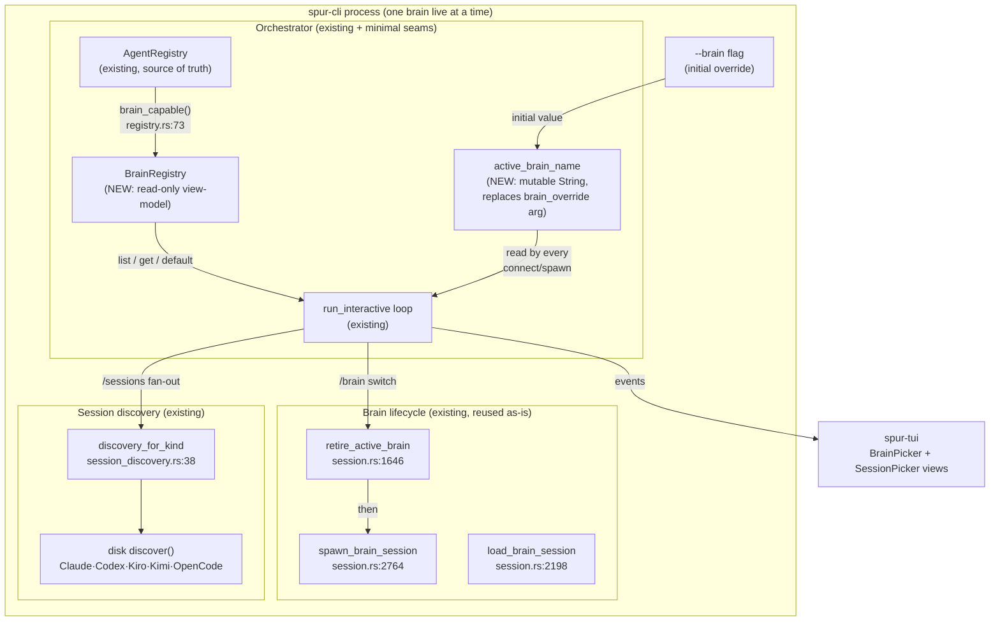
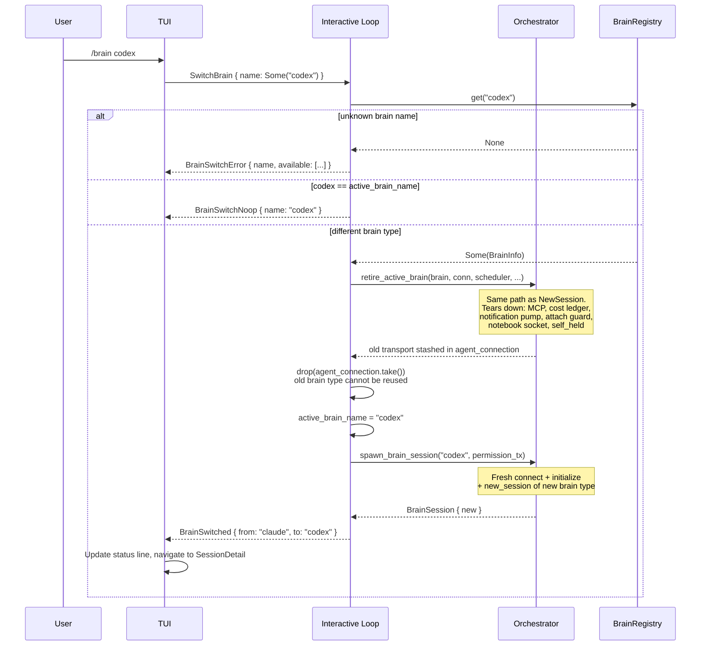
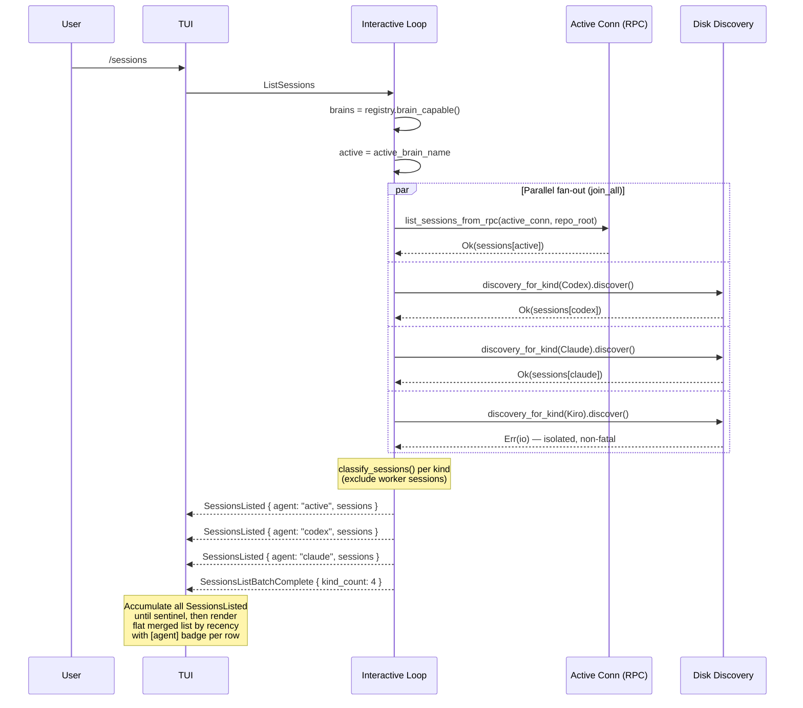
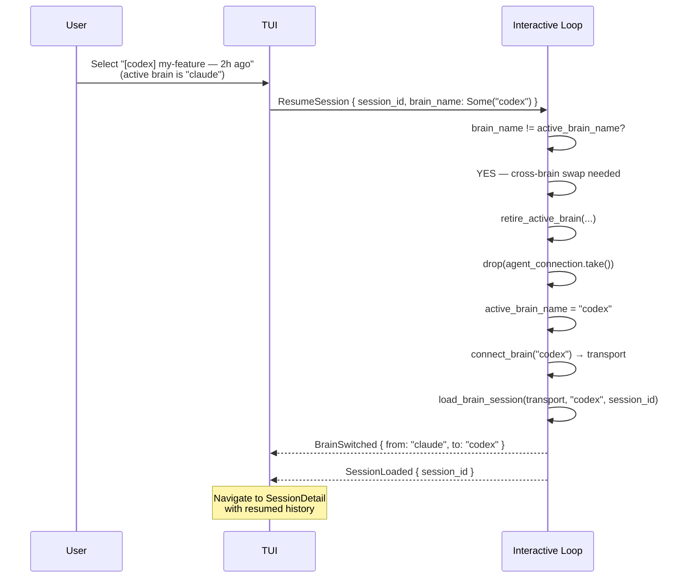

# Multi-brain hot-swap & unified session picker

**Status:** design (not yet implemented)
**Date:** 2026-07-05
**Scope:** Allow switching the active brain type within a running `spur` process without restart (Scope A), and unify the session picker to show sessions from all registered brain types in a single flat merged list (Scope B). Scope C (multiple concurrent live brains) is explicitly deferred.

---

## 1. Problem

Today SPUR pins the brain type at process start via `--brain <name>` and never mutates it:

- **One brain per process.** `crates/spur-core/src/orchestrator/interactive_loop.rs:280` declares `let mut brain: Option<BrainSession> = None;` — a singular `Option`, not a map.
- **Brain type is fixed for the loop lifetime.** The flag is threaded as `brain_override: Option<String>` into `run_interactive` (`interactive_loop.rs:273`), originating from `crates/spur-cli/src/main.rs:1585` (`--brain={}`). Every `(re)connect`/`spawn` reuses the same override: `connect_brain(brain_override.as_deref(), ...)` at `interactive_loop.rs` lines 370, 510, 610, 1543, 1675.
- **Session listing is per-brain-type.** `InteractiveInput::ListSessions` (`interactive_loop.rs:499-563`) queries through the single active connection via `list_sessions_from_rpc`. The result is emitted tagged with that one brain: `SessionsListed { agent: brain_name, sessions }` (`interactive_loop.rs:240-243`).

Consequences:
1. Switching from claude to codex (or any other brain) requires shutting down `spur` and restarting with a different `--brain` flag.
2. The session picker only ever shows sessions for the currently selected brain type. Sessions from other brain types — stored in their own on-disk locations — are invisible.

## 2. Goal

Two capabilities, delivered in order:

- **Scope A — Hot-swap a single active brain in-process.** A `/brain <name>` command (plus a bare `/brain` picker and a read-only `/brains` listing) retires the current brain and spawns a fresh one of a different type. Switching always retires (warm-restart semantics); exactly one live brain at a time; no background brains.
- **Scope B — Unified session picker.** `list_sessions` fans out across all brain-capable agents in the registry and shows a flat merged list with a brain-kind badge per row. Picking a row whose brain type differs from the active one triggers an automatic brain swap + `load_session`.

## 3. Non-goals

- **Multiple concurrent live brains (Scope C).** `brain: Option<BrainSession>` stays singular. No connection pool, no background brain processes, no N-way MCP/cost/notebook-socket fan-out.
- **Cross-restart persistence of last-used brain.** Each terminal is its own brain TUI; persisting "last used" would cause cross-terminal confusion. Brain selection is per-process from `--brain` flag or registry default.
- **Gemini support.** Google has shut down the Gemini CLI; Gemini is removed from the brain-kind set. (Cleanup of `AgentKind::Gemini` from the enum and `discovery_for_kind` is a prerequisite, tracked separately.)
- **Changing the `SessionsListed` event shape.** The existing `{ agent: String, sessions: Vec<SessionInfo> }` is sufficient — one event per brain kind, tagged with its `agent`.
- **Changing the `SessionInfo` type.** No new fields on the shared ACP protocol type.

## 4. Background — verified substrate

All file:line refs verified 2026-07-05 against the worktree graph.

### 4.1 Brain lifecycle is well-factored and re-entrant

- `retire_active_brain` (`session.rs:1646-1795`): tears down MCP server (`shutdown_mcp_server`), cost ledger (`cost_tracker.take()` → `end_session`), notification pump (bounded drain + abort), delegation handle abort, attach guard release, notebook socket removal (`remove_notebook_socket`), `self_held` removal. Stashes the transport in `ActiveConnection` for reuse.
- `create_brain_session` (`session.rs:1908-2190`): starts MCP callback server, creates ACP session, registers notebook socket, starts cost session, spawns delegation handler, emits `BrainSpawned` + `AgentSessionReady`.
- `spawn_brain_session` (`session.rs:2764`): connects transport + calls `create_brain_session`.
- `load_brain_session` (`session.rs:2198`): connects transport + loads existing session via `load_session` RPC.
- **Re-entrancy is proven by existing usage.** `NewSession` (`interactive_loop.rs:437-470`) and `ResumeSession` (`interactive_loop.rs:583-600`) already execute the retire → (reuse-or-connect) → create/load cycle mid-loop. Scope A's `/brain` swap is mechanically identical to `NewSession` with a different brain name.

### 4.2 Registry exposes brain-capable agents

- `AgentRegistry::brain_capable()` (`crates/spur-acp/src/registry.rs:73-79`): returns all agents whose `config.role` is `AgentRole::Brain | AgentRole::Both`. This is the enumeration source for the brain picker.

### 4.3 Disk discovery exists for all relevant brain kinds

- `discovery_for_kind` (`session_discovery.rs:38-49`) maps `AgentKind` to `SessionDiscoveryKind`:
  - `ClaudeCodeAcp` | `ClaudeStreamJson` → `Claude`
  - `CodexAcp` → `Codex`
  - `Kiro` → `Kiro`
  - `Kimi` → `Kimi`
  - `OpenCode` → `OpenCode`
  - `Gemini` | `Generic` → `None`
- Each `SessionDiscoveryKind` variant implements `discover()` (`session_discovery.rs:24-35`) — a pure disk read returning `Vec<SessionInfo>`. **No subprocess spawn required.**
- After Gemini removal, the only kind returning `None` is `Generic` (the untyped fallback for agents missing a `kind` in config). `Generic`-kind agents degrade gracefully: they appear in the merged picker only if they are the active brain (RPC path).

### 4.4 SessionsListed event already carries per-event agent tag

- `SessionsListed { agent: String, sessions: Vec<SessionInfo> }` (`crates/spur-acp/src/domain/events.rs:1138-1141`). The `agent` field identifies which brain kind the sessions belong to. Emitting one event per brain kind — each tagged with its `agent` — gives the TUI everything it needs to render a flat merged list with badges. **No shape change required.**

### 4.5 classify_sessions separates brain from worker sessions

- `classify_sessions(sessions, repo_root)` (`session_discovery.rs:58`): splits discovered sessions into brain-eligible and worker sessions based on `cwd` matching `repo_root`. Called per-kind during fan-out to exclude worker sessions from the picker.

## 5. Design

### 5.1 Architecture overview



**Design principles:**

1. **No new source of truth.** `BrainRegistry` is a typed projection over the existing `AgentRegistry` — derived on demand, never persisted.
2. **One mutable seam.** `active_brain_name: String` replaces the `brain_override: Option<String>` argument. It is a mutable local in `run_interactive`, set once at startup from the CLI flag, mutated by `/brain`.
3. **Scope A reuses existing machinery.** `retire_active_brain` → `spawn_brain_session` is mechanically identical to the existing `NewSession` handler (`interactive_loop.rs:437-470`). The only new code: validate target brain, drop the stashed old-type transport, set `active_brain_name`, call `spawn_brain_session`.
4. **Scope B is disk-first.** Non-active brains listed via `discovery_for_kind` → `discover()` (disk read, no subprocess). Only the active brain uses RPC. Fan-out is parallel via `futures::future::join_all`.

**What does NOT change:**

- `brain: Option<BrainSession>` stays singular (scope C deferred).
- `retire_active_brain` / `create_brain_session` / `spawn_brain_session` / `load_brain_session` bodies — untouched.
- `SessionInfo` type — untouched.
- `SessionsListed` event shape — untouched (one event per kind, tagged with existing `agent` field).
- Worker routing (`DashMap<BrainSessionId, WorkerMcpServer>`) — already multi-brain, untouched.

### 5.2 New types

```rust
// crates/spur-core/src/orchestrator/brain_registry.rs (NEW file)

/// Read-only view-model over AgentRegistry.
/// Derived on demand; never persisted.
pub struct BrainRegistry {
    brains: Vec<BrainInfo>,
}

pub struct BrainInfo {
    pub name: String,       // agent name from config, e.g. "codex"
    pub kind: AgentKind,    // for discovery routing
    pub is_default: bool,
}

impl BrainRegistry {
    /// Derived from AgentRegistry; default resolved by config or first-in-order.
    pub fn from(reg: &AgentRegistry, default: Option<&str>) -> Self { ... }
    pub fn list(&self) -> &[BrainInfo] { &self.brains }
    pub fn get(&self, name: &str) -> Option<&BrainInfo> { ... }
    pub fn default(&self) -> Option<&BrainInfo> { ... }
}
```

### 5.3 New InteractiveInput variants

```rust
// Existing: NewSession, ResumeSession, ListSessions, Message, ...
// NEW:
InteractiveInput::SwitchBrain { name: Option<String> },  // /brain [<name>]
InteractiveInput::ListBrains,                            // /brains (read-only)

// EXTENDED (backward-compatible new field):
InteractiveInput::ResumeSession {
    session_id: String,
    brain_name: Option<String>,  // NEW: None or same-as-active → existing flow;
                                 //      Some(other) → swap brain first, then load
},
```

### 5.4 New SpurEventBody variants (additive, backward-compatible)

```rust
// Scope A:
SpurEventBody::BrainSwitched { from: String, to: String },
SpurEventBody::BrainSwitchNoop { name: String },
SpurEventBody::BrainSwitchError { name: String, available: Vec<String> },
SpurEventBody::BrainsListed { brains: Vec<BrainInfo>, active: String },   // /brains response
SpurEventBody::BrainPickerOpen { brains: Vec<BrainInfo>, active: String }, // bare /brain

// Scope B:
SpurEventBody::SessionsListBatchComplete { kind_count: usize },
```

No existing `SpurEventBody` variant is modified. All additions are new variants — backward-compatible at the serialization layer.

### 5.5 Scope A — Brain switch flow



**Bare `/brain` (no arg) variant:** emits `BrainPickerOpen { brains, active }` → TUI shows the brain-kind picker (reuses `SessionPickerView` rendering pattern). User selects → emits `SwitchBrain { name: Some(selected) }` → same flow above.

**`/brains` (plural) read-only listing:** emits `BrainsListed { brains, active }` → TUI renders a static table (name, kind, active marker). No state change.

**Key invariant preserved:** the `retire → drop-stashed → spawn` cycle maintains exactly one live brain at all times (except for the brief teardown gap, identical to `NewSession`). No background brains, no transport pool, no scope-C creep.

### 5.6 Scope B — Unified session listing



**Fan-out implementation shape:**

```rust
// Pseudocode for the new ListSessions handler
let brains = BrainRegistry::from(&self.registry, ...);
let active = self.active_brain_name.clone();

// Active brain: RPC (existing path, unchanged)
let active_fut = async {
    let sessions = Self::list_sessions_from_rpc(&mut *conn, &repo_root).await
        .or_else(|_| Self::list_sessions_from_disk(active_cfg));  // existing fallback
    (active.clone(), sessions)
};

// Non-active brains: disk only (no subprocess spawn)
let disk_futs = brains.list().iter()
    .filter(|b| b.name != active)
    .filter_map(|b| discovery_for_kind(b.kind).map(|d| (b.name.clone(), d)))
    .map(|(name, d)| async move { (name, d.discover()) });

// Parallel fan-out
let results = join_all(once(active_fut).chain(disk_futs)).await;

// Emit per-kind + sentinel
for (agent, result) in results {
    let sessions = result.unwrap_or_default();  // partial failure → empty, non-fatal
    let (brain_sessions, _) = classify_sessions(sessions, &repo_root);
    self.emit(SessionsListed { agent, sessions: brain_sessions });
}
self.emit(SessionsListBatchComplete { kind_count: results.len() });
```

**Key properties:**

- **Zero subprocess spawns** for non-active brains — pure disk reads, fanned out in parallel.
- **Partial failure isolation** — one brain kind's disk error produces an empty entry (`unwrap_or_default`), not a batch failure.
- **Active brain unchanged** — same RPC-then-disk-fallback path as today.
- **`Generic` agents** — `discovery_for_kind(Generic) → None`, filtered out silently. They appear only if they are the active brain (RPC path).

### 5.7 Cross-brain resume (auto-swap on pick)

When the user selects a session whose `[agent]` badge differs from the active brain:



This extends the existing `ResumeSession` handler (`interactive_loop.rs:583-600`). Today it does: retire → reuse-or-connect → `load_brain_session`. The cross-brain variant adds: if `brain_name` differs from active → drop the stashed old-type connection before connecting the new type.

## 6. Error handling & edge cases

| Scenario | Behavior |
|---|---|
| Active brain RPC fails | Falls back to `list_sessions_from_disk` (existing behavior). If disk also fails → that kind shows empty, other kinds still populate. |
| Non-active brain disk discovery fails | `unwrap_or_default()` → empty `SessionsListed` for that kind. Debug log. Other kinds unaffected. **Non-fatal.** |
| `Generic`-kind agent in registry | `discovery_for_kind → None` → silently omitted from fan-out. Appears only if active (RPC). |
| Only one brain in registry | Fan-out is just the active brain's RPC. `kind_count: 1`. Picker behaves identically to today. |
| Cross-brain resume: `load_session` fails after swap | Brain is already switched (`BrainSwitched` emitted). Emit `SessionLoadError`. User lands on new brain with fresh session; can retry from picker. |
| `/brain` to unknown name | `BrainSwitchError { name, available }` with the list of valid brain names. No state change. |
| `/brain` to current active brain | `BrainSwitchNoop`. No retire, no spawn. |
| Brain registry is empty (no brain-capable agents) | `BrainSwitchError { available: [] }`. `ListSessions` emits single empty `SessionsListed` + sentinel. |
| Race: brain switch while fan-out in flight | Fan-out captures `active_brain_name` snapshot at dispatch time. Results are still valid (each tagged with its own `agent`). TUI renders whatever arrives before the sentinel. |

## 7. Testing strategy

### 7.1 Unit tests

- `BrainRegistry::from()` — derives correctly from `AgentRegistry`, marks `is_default`.
- `BrainRegistry::get()` / `default()` — known name, unknown name, empty registry.
- Remove `Gemini` variant from `discovery_for_kind_maps_expected_variants` test (`session_discovery.rs:1091`).

### 7.2 Orchestrator integration tests

In `interactive_loop.rs` test module, following the `list_sessions_tests` pattern (`interactive_loop.rs:1930+`):

- `switch_brain_retires_old_and_spawns_new_type` — verifies retire → drop-stashed → spawn with new name.
- `switch_brain_unknown_name_emits_error_with_available_list`.
- `switch_brain_same_name_emits_noop` — no retire fired.
- `list_sessions_fans_out_across_brain_kinds` — multiple `SessionsListed` events + sentinel.
- `list_sessions_disk_failure_for_one_kind_does_not_block_others` — partial failure isolation.
- `resume_cross_brain_session_triggers_swap_then_load`.

### 7.3 Serialization roundtrip tests

Per AGENTS.md mandate, new `SpurEventBody` variants require roundtrip tests in `crates/spur-acp/tests/executor_events_roundtrip.rs`:

- `BrainSwitched`, `BrainSwitchNoop`, `BrainSwitchError`, `BrainsListed`, `BrainPickerOpen`, `SessionsListBatchComplete`.

### 7.4 TUI tests (spur-tui)

- Brain picker renders registry list with active marker, arrow-key select.
- Session picker **accumulates** across multiple `SessionsListed` until `SessionsListBatchComplete`, then renders sorted by recency with `[agent]` badge.
- Selecting a cross-brain row emits `ResumeSession { brain_name: Some(other) }`.

## 8. Files changed

| File | Change |
|------|--------|
| `crates/spur-core/src/orchestrator/brain_registry.rs` | **NEW.** `BrainRegistry` + `BrainInfo` types, `from()` / `get()` / `default()` / `list()`. |
| `crates/spur-core/src/orchestrator/mod.rs` (or equivalent module root) | Re-export `BrainRegistry`. |
| `crates/spur-core/src/orchestrator/interactive_loop.rs` | Replace `brain_override` arg with mutable `active_brain_name` local. Add `SwitchBrain` / `ListBrains` handlers. Extend `ListSessions` handler with disk-first fan-out. Extend `ResumeSession` with cross-brain swap. |
| `crates/spur-core/src/orchestrator/session.rs` | No body changes. (Lifecycle methods reused as-is.) |
| `crates/spur-acp/src/domain/events.rs` | Add `BrainSwitched`, `BrainSwitchNoop`, `BrainSwitchError`, `BrainsListed`, `BrainPickerOpen`, `SessionsListBatchComplete` variants. |
| `crates/spur-acp/src/domain/commands.rs` (or equivalent input enum) | Add `SwitchBrain { name: Option<String> }`, `ListBrains`. Extend `ResumeSession` with `brain_name: Option<String>`. |
| `crates/spur-acp/src/registry.rs` | No changes (`brain_capable()` already exists at `:73`). |
| `crates/spur-acp/tests/executor_events_roundtrip.rs` | Roundtrip tests for new event variants. |
| `crates/spur-tui/src/views/` | Brain picker view (new), session picker accumulation logic (modified). |
| `crates/spur-acp/src/types.rs` (or wherever `AgentKind` lives) | Remove `Gemini` variant (prerequisite cleanup, may be separate PR). |

## 9. Implementation order

1. **Prerequisite:** Remove `Gemini` from `AgentKind` + `discovery_for_kind` (separate cleanup commit).
2. **Scope A core:** `BrainRegistry` type + `active_brain_name` mutable local + `SwitchBrain` handler (retire → drop → spawn).
3. **Scope A commands:** `/brain <name>` direct, `/brain` bare picker, `/brains` listing. Wire TUI brain picker view.
4. **Scope A events:** New `SpurEventBody` variants + roundtrip tests.
5. **Scope B core:** `ListSessions` fan-out (disk-first for non-active, RPC for active, parallel `join_all`). `SessionsListBatchComplete` sentinel.
6. **Scope B TUI:** Session picker accumulation + merged rendering + `[agent]` badge.
7. **Scope B resume:** Cross-brain `ResumeSession` with auto-swap.

Each step is independently testable and committable. Steps 2–4 deliver Scope A end-to-end; steps 5–7 deliver Scope B.
