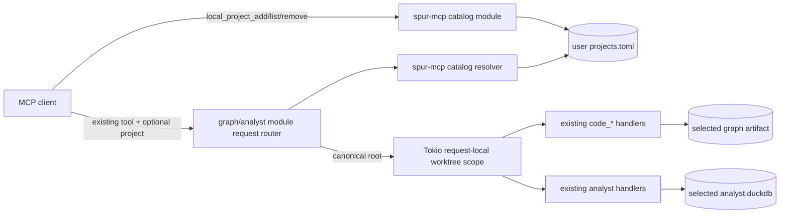

# Named Local-Project Query Routing Design

**Date:** 2026-07-15
**Issue:** `bd-2ztrq`
**Status:** Approved for implementation planning

## Summary

SPUR's local retrieval tools currently resolve all graph and analyst state from
one request-scoped worktree. The standalone MCP commands can choose that
worktree once at process startup with `--root`, but an individual MCP request
cannot select another local repository. The separate `external_*` tools solve a
different problem: they address package/revision data in the context-service
catalog.

This feature adds a persistent user-level catalog of already-indexed local Git
projects. A user registers a canonical repository root under a stable name,
then passes that name through an optional `project` field on the existing local
retrieval tools. The graph and analyst modules translate the name into the
existing request-local worktree scope, so current artifact selection, graph
overlay/rebuild behavior, analyst freshness checks, and connection pooling are
reused rather than duplicated.

The default remains the active project. Calls that omit `project` keep their
current behavior and response shape.

## Goals

1. Let a user register, list, replace, and remove named local projects through
   MCP tools.
2. Let every local `code_*` and analyst retrieval tool query one registered
   project per request.
3. Preserve current-project compatibility when `project` is omitted.
4. Reuse the existing per-worktree graph and analyst query paths, including
   their current freshness and dirty-worktree behavior.
5. Isolate concurrent requests for different projects and keep all caches
   project-aware.
6. Keep delegated workers confined to their assigned worktrees by default.

## Non-goals

- Cross-project SQL, joins, graph traversal, semantic search, or result merging.
- A federated graph or global stable-symbol namespace.
- Fetching, cloning, or initially indexing a project during registration.
- Replacing the context-service `external_*` package/revision surface.
- Giving delegated workers access to arbitrary registered projects.
- Deleting graph or analyst artifacts when a registration is removed.

## Current behavior

The existing implementation already supplies the routing primitive this
feature needs:

- `spur graph mcp`, `spur analyst mcp`, and bundled `spur mcp` install one
  optional root through
  `spur_graph::mcp::with_worktree_root_for_request` around the server future.
- Each `code_*` handler resolves its artifact from the current task-local
  worktree root.
- `spur-analyst` resolves `.spur/analyst.duckdb` from the same task-local root.
- The raw analyst `query` pool is keyed by database path.
- Graph rebuild/overlay coordination is already keyed by worktree state.

The missing layer is a safe name-to-root resolver at individual tool-call
boundaries.

## User-facing API

### Catalog-management tools

User-facing and brain MCP servers expose three tools.

#### `local_project_add`

Input:

```json
{
  "name": "notebook",
  "path": "/Volumes/Projects/spur-notebook",
  "replace": false
}
```

- `name` is required, case-sensitive, and must match
  `[A-Za-z0-9][A-Za-z0-9._-]{0,63}`.
- `path` is required and must be an absolute UTF-8 path. Symlinks are
  canonicalized and the resolved Git worktree root is stored.
- `replace` defaults to `false`.
- Adding an identical name/root mapping is idempotent.
- Reusing a name for another root fails unless `replace` is `true`.
- Registration validates that the root is a Git worktree and that both the
  graph artifact and analyst database are resolvable through the same helpers
  used by normal queries.
- Registration never builds an index.

An idempotent add returns `changed: false` and does not increment the catalog
generation.

Response:

```json
{
  "changed": true,
  "project": {
    "name": "notebook",
    "root": "/Volumes/Projects/spur-notebook",
    "status": "ready"
  },
  "catalog_generation": 4
}
```

#### `local_project_list`

Input is an empty object. The response returns entries sorted by name and a
live health status for each root. A moved repository or missing index remains
visible with `status: "unavailable"` and an actionable reason; listing does not
silently prune it.

#### `local_project_remove`

Input:

```json
{"name":"notebook"}
```

Removal is idempotent and returns `removed: false` for an unknown name. It only
changes the catalog. An unknown-name removal does not increment the generation.
Removal does not touch the repository or its `.spur` data.

### Retrieval-tool extension

The following existing tools gain one optional string property:

```json
{"project":"notebook"}
```

The property applies to:

- `code_resolve`
- `code_symbol_search` and its `code_search` alias
- `code_file_symbols`
- `code_symbol_info`
- `code_read_symbol`
- `code_callers`
- `code_callees`
- `code_subgraph`
- `code_symbol_history`
- `query`
- `doc_navigate`
- `knowledge_context_pack`
- `knowledge_context_pack_2`

The field is optional in every schema, including schemas with
`additionalProperties: false`. Existing required fields and defaults do not
change.

### Explicit-scope response metadata

When `project` is present, the response gains a top-level scope object:

```json
{
  "project": {
    "name": "notebook",
    "root": "/Volumes/Projects/spur-notebook",
    "catalog_generation": 4
  }
}
```

Calls without `project` do not gain this field. This preserves existing output
snapshots for current-project callers.

Project-scoped knowledge-pack `next` and `recommended_next_tools` entries also
carry `project: "notebook"`. A `graph://symbol/<id>` remains local to one graph;
follow-up calls must repeat the project name.

## Catalog storage

### Location

The catalog path is resolved in this order:

1. `SPUR_PROJECT_CATALOG`, interpreted as an exact file path.
2. `$XDG_CONFIG_HOME/spur/projects.toml` when `XDG_CONFIG_HOME` is set.
3. `$HOME/.config/spur/projects.toml`.

The explicit override makes tests hermetic and supports portable installations.
Failure to resolve a user config directory is an actionable catalog error, not
a fallback to a repository-local file.

### Format

The versioned TOML format is intentionally small:

```toml
version = 1
generation = 4

[[projects]]
name = "notebook"
root = "/Volumes/Projects/spur-notebook"
```

Entries are stored in name order. Only the canonical name and root are durable;
health and index metadata are derived live so they cannot become misleading.
Unknown format versions fail closed.

### Consistency and permissions

- A sibling `projects.toml.lock` file provides inter-process shared/exclusive
  locking with the workspace's existing `fs2` pattern.
- Mutations reload the file while holding the exclusive lock, increment
  `generation`, serialize to a temporary file in the same directory, sync the
  file, atomically rename it, and sync the parent directory where supported.
- Catalog-owned directories created by SPUR use `0700` on Unix. A pre-existing
  explicit or override parent keeps its existing permissions.
- Catalog, temporary, and lock files use `0600` on Unix. An existing regular
  catalog file with broader permissions is repaired to `0600` while locked.
- Catalog presence checks use symlink-aware metadata. Only `NotFound` means an
  absent catalog; metadata failures and non-regular paths, including dangling
  or valid symlinks, fail closed without replacing the directory entry.
- Readers parse one immutable snapshot under a shared lock and release the lock
  before project queries begin.
- An in-flight request keeps its resolved canonical root even if the entry is
  replaced or removed. Later requests observe the new generation.

`spur-mcp` owns the catalog format, locking, storage, resolver, management tool
definitions, and a validator interface. Production composition injects a
validator backed by `spur-graph` and `spur-analyst`, avoiding a dependency cycle
from `spur-mcp` back into those crates.

## Architecture



### `spur-mcp`

Add a `local_projects` module containing:

- `LocalProjectCatalogStore`
- `LocalProjectCatalogSnapshot`
- `LocalProjectEntry`
- `LocalProjectResolver`
- `LocalProjectValidator` trait and health result types
- `LocalProjectCatalogMcpModule`
- `ProjectAccessPolicy`
- helpers that add the optional `project` property to tool schemas and decorate
  explicitly scoped responses

Production dependencies add `toml` and `fs2`, both already used elsewhere in
the workspace. No new third-party dependency family is introduced.

### `spur-graph`

`GraphMcpModule` gains an enabled constructor that accepts a shared catalog
resolver while its existing constructor remains worktree-only. Enabled
dispatch performs:

1. Parse and remove optional `project` from a cloned argument object.
2. Resolve the name against one catalog snapshot.
3. Install the canonical root with
   `with_worktree_root_for_request(root, inner_dispatch(...))`.
4. Decorate a successful response with scope metadata.

The inner dispatch and all existing code handlers remain the source of truth.
Graph artifact validation is exposed through a narrow function used by the
injected catalog validator.

### `spur-analyst`

`AnalystMcpModule` receives the same enabled/worktree-only constructor split.
All four analyst handlers route through the selected task-local root. The raw
`query` handler continues to select and pool connections by resolved database
path, and all existing read-only and freshness gates remain in force.

Analyst validation exposes a narrow check that uses the same database-path
selection logic as a real query. Knowledge-pack suggestion builders propagate
the selected project name into follow-up tool arguments after filtering out
suggestions that are not callable on the same local-project server surface.

### `spur-core` and `spur-cli`

- Standalone graph, standalone analyst, bundled `spur mcp`, and the brain MCP
  surface share one catalog store/resolver and register the catalog-management
  module.
- The brain graph and analyst handlers use project-enabled module constructors.
- Delegated worker MCP servers continue using the existing worktree-only graph
  constructor. Their advertised tool schemas omit `project`, and catalog
  mutation tools are not registered.
- `spur-core`, which already depends on both graph and analyst implementations,
  exports the small composite validator used by its brain server and by
  `spur-cli` standalone composition.

## Request lifecycle

For `code_symbol_search({project: "notebook", ...})`:

1. The graph module snapshots the catalog and resolves `notebook`.
2. Missing or unhealthy entries fail before any graph handler executes.
3. The module removes `project` so existing argument parsers see their original
   input contract.
4. The selected canonical root is installed in Tokio task-local scope.
5. The existing search handler resolves the graph artifact and applies its
   normal rebuild-aware/dirty-worktree behavior.
6. The result is decorated with project metadata and returned.
7. Dropping the future drops the task-local scope. No process-global current
   directory or environment variable changes.

Analyst requests follow the same lifecycle. "Reuse current rebuild-aware
behavior" means each tool retains its current semantics: exact graph tools may
use their existing rebuild/overlay coordinator, while raw analyst SQL retains
its existing freshness gate and does not gain a new indexing side effect.

## Cache and concurrency invariants

1. Project routing never calls `set_current_dir` or mutates `SPUR_WORKTREE`.
2. The canonical root/database path participates in every reusable cache key.
3. The raw SQL connection pool remains keyed by analyst database path.
4. Graph rebuild coordination remains keyed by worktree and rebuild state.
5. Any analyst search/embedding cache that is not currently root-aware must be
   made root-aware before enabling project routing.
6. Two concurrent requests targeting different projects cannot observe each
   other's task-local roots, artifacts, connections, or response metadata.
7. Replacing a name does not reuse name-keyed artifact state from its former
   root.

## Error model

Project routing fails closed. It never falls back to the active repository.

| Condition | Result |
|---|---|
| Invalid project name | Invalid-params error identifying the name rule |
| Unknown registered name | Not-found error naming the missing project |
| Catalog parse/version failure | Internal catalog error with the file path and corrective action |
| Name mapped to another root without `replace` | Conflict error showing the registered root |
| Root moved or deleted | Project-unavailable error; `local_project_list` reports the same state |
| Git root invalid | Registration or query fails before handler dispatch |
| Graph artifact missing | Registration/query reports graph index unavailable |
| Analyst database missing | Registration/query reports analyst index unavailable |
| Graph refresh fails | Existing graph rebuild error/staleness contract is preserved |
| Analyst index stale | Existing freshness gate and `allow_stale` behavior are preserved |
| Catalog lock/write failure | Mutation fails without modifying the prior catalog |
| `project` supplied on a worker-only module | Omitted from its advertised schema and rejected by direct dispatch |

Raw SQL remains subject to the existing write-statement rejection. Selecting a
project does not authorize `ATTACH`, arbitrary database paths, or filesystem
writes.

## Compatibility

- Existing constructors remain available with worktree-only behavior.
- Existing tool names, aliases, required inputs, defaults, and output shapes
  remain intact for calls without `project`.
- The context-service `external_*` schemas and selectors do not change.
- Registered projects do not alter server startup roots.
- No catalog file is created until the first successful mutation.
- Catalog removal is reversible by registering the same existing root again.

## Testing strategy

Implementation follows the repository's TDD cadence: failing behavioral tests
are committed before production changes.

### `spur-mcp`

- Catalog path precedence and hermetic override.
- TOML round-trip, deterministic ordering, and unknown-version rejection.
- Name validation and path canonicalization boundaries.
- Idempotent add and remove.
- Conflicting add and explicit replacement.
- Shared/exclusive locking and concurrent mutation without lost updates.
- Atomic-write failure preserves the old catalog.
- Unix directory/file permissions, existing-parent preservation, catalog mode
  repair, and fail-closed catalog symlink handling.
- Corrupt catalog and unavailable-root error envelopes.
- Schema decoration and access-policy behavior.

### `spur-graph`

- Every `code_*` definition gains `project` only when project access is enabled.
- A project-scoped search/read/call-edge request selects the registered graph.
- Default calls still target the request's active worktree.
- Stale/dirty registered roots reuse existing rebuild-aware behavior.
- Response scope metadata is correct.
- Concurrent requests to two fixture projects do not leak roots or cache state.

### `spur-analyst`

- `query`, `doc_navigate`, and both knowledge-pack tools select the registered
  analyst database.
- Raw query connections remain separated by database path.
- `allow_stale` and freshness warnings retain their current semantics.
- Knowledge-pack follow-up suggestions repeat the selected project.
- Concurrent fixture queries prove connection/search cache isolation.

### `spur-core` and `spur-cli`

- User-facing/brain registries advertise management tools and project-enabled
  retrieval schemas.
- Standalone graph, standalone analyst, and bundled server composition share
  one catalog snapshot source.
- Worker registries omit management tools and cannot route outside their
  assigned worktree.
- End-to-end fixture: add two indexed repositories, query distinct symbols and
  SQL counts, replace/remove one entry, and verify the other remains unaffected.

### Verification commands

All compile-heavy verification uses the repository wrapper:

```bash
scripts/spur-cargo test -p spur-mcp
scripts/spur-cargo test -p spur-graph
scripts/spur-cargo test -p spur-analyst
scripts/spur-cargo test -p spur-core
scripts/spur-cargo test -p spur-cli
scripts/spur-cargo fmt --all
SPUR_REMOTE=1 scripts/spur-cargo clippy --workspace -- -D warnings
```

The implementation plan may narrow intermediate test invocations, but final
verification covers every affected crate.

## Documentation

Update MCP tool descriptions, standalone server instructions, the architecture
documentation, and the user guide with this flow:

```json
{"name":"notebook","path":"/Volumes/Projects/spur-notebook"}
```

```json
{"project":"notebook","query":"NotebookDaemon","mode":"substring"}
```

```json
{"query":"SELECT file_path, entity_name FROM nodes LIMIT 20","project":"notebook"}
```

Documentation must distinguish named local projects from external packages:
local projects use existing tools plus `project`; hosted packages continue to
use `external_*` plus package/revision selectors.

## Acceptance criteria

1. A user can add, list, replace, and remove an already-indexed local Git
   project by stable name through MCP.
2. All listed local graph and analyst tools accept that name through optional
   `project` and query the selected repository.
3. Calls without `project` retain current-project behavior.
4. Explicit responses and generated follow-up suggestions identify project
   scope.
5. Concurrent cross-project calls remain isolated.
6. Existing graph rebuild/overlay and analyst freshness semantics are
   preserved.
7. Missing, moved, corrupt, or unindexed projects fail closed without switching
   repositories.
8. Delegated workers cannot use the catalog to escape their assigned worktree.
9. The affected crate suites and workspace lint checks pass through
   `scripts/spur-cargo`.
