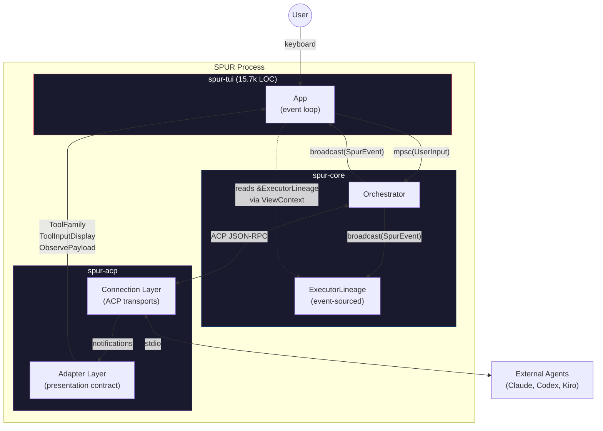
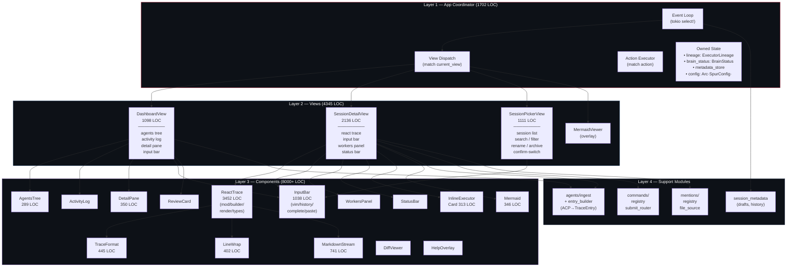
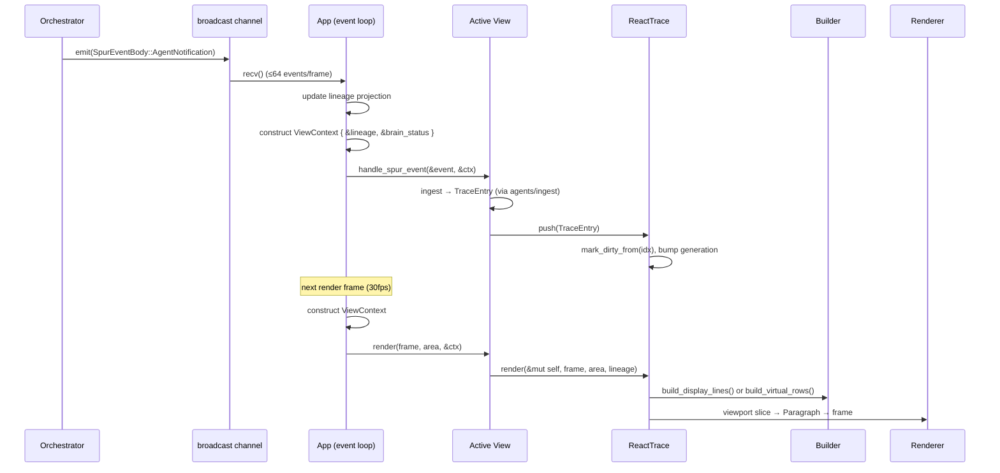
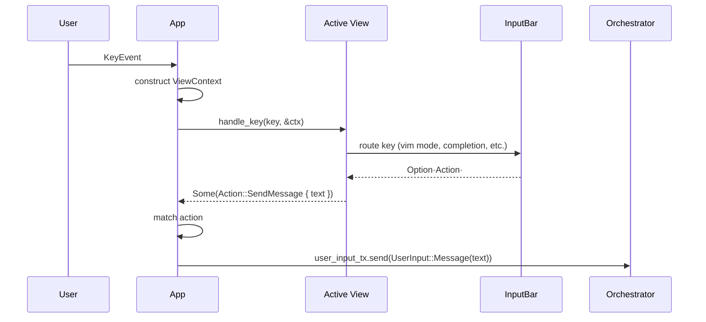
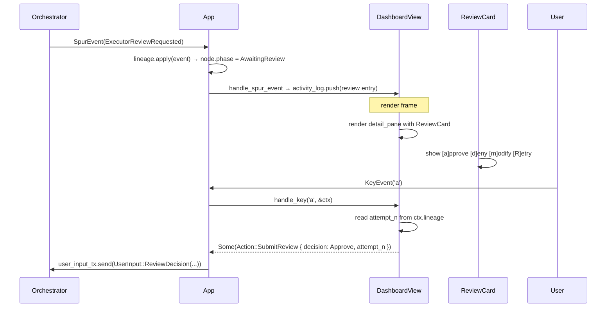
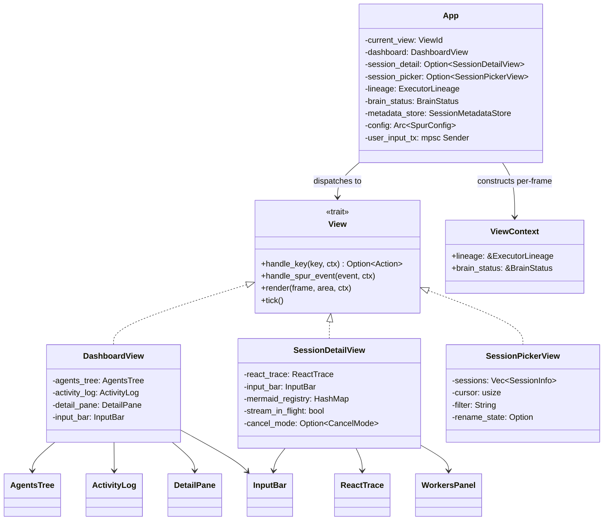
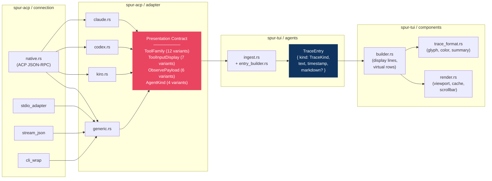
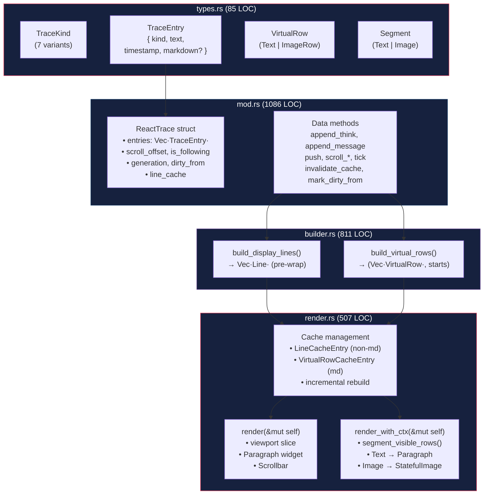
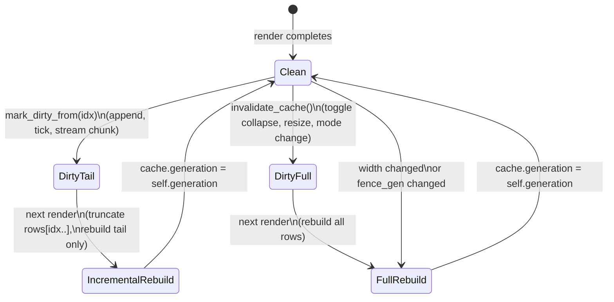
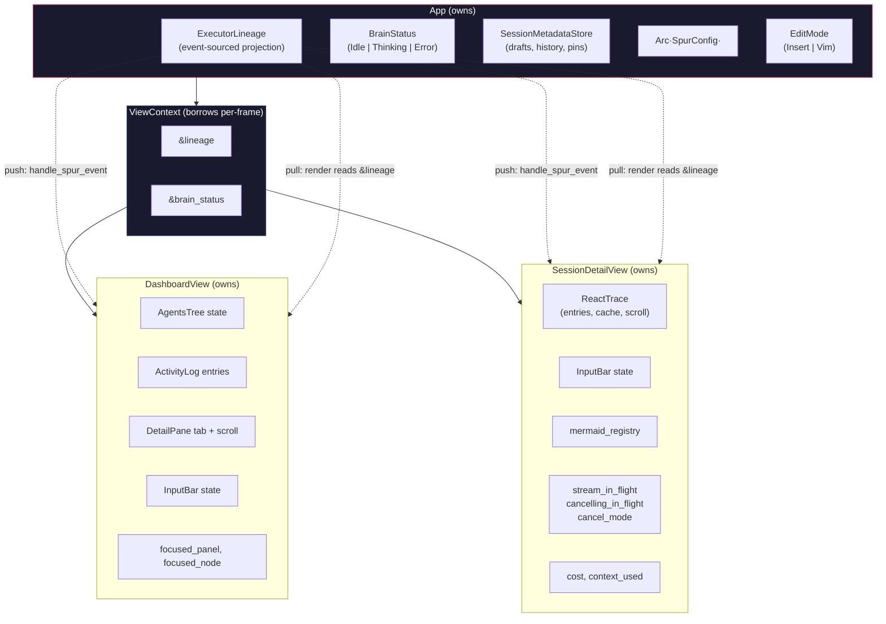

# SPUR TUI Architecture

> Reviewed 2026-04-16. Covers `spur-tui` (15.7k LOC) and its interface with `spur-acp` (6.4k LOC).

## 1. System Context

The TUI is the user-facing presentation layer. It consumes events from the orchestrator, renders them as a terminal interface, and sends user commands back.

---

## 2. Internal Layer Architecture

Four layers with strict downward dependencies. No upward calls — only `Action` values bubble up via return.

---

## 3. Event & Data Flow

### 3a. Inbound: SpurEvent → Screen

### 3b. Outbound: Keypress → Orchestrator

### 3c. Review Loop

---

## 4. View Trait & ViewContext

---

## 5. ACP Adapter → TUI Rendering Pipeline

The adapter layer in `spur-acp` creates a presentation contract that the TUI consumes without knowing which agent produced the data.

### Adding a New Agent

| Step | File | Change |
|---|---|---|
| 1 | `spur-acp/src/adapter/gemini.rs` | New adapter: parse notifications → ToolFamily + ToolInputDisplay + ObservePayload |
| 2 | `spur-acp/src/types.rs` | Add `AgentKind::Gemini` variant |
| 3 | `spur-acp/src/connection/` | Transport support (if non-stdio) |
| 4 | `spur-tui/src/components/react_trace/mod.rs` | 1 line: accent color in `pane_title_and_color()` |
| — | All other TUI files | **Zero changes** |

---

## 6. ReactTrace Render Pipeline

The largest component (3452 LOC), decomposed into 4 submodules after P3.3a.

### Cache Invalidation Strategy

---

## 7. State Ownership

**Push vs Pull:**
- **Push**: App calls `view.handle_spur_event()` — views update their own state (activity log entries, trace entries, stream flags)
- **Pull**: Views read `ctx.lineage` during `render()` — for live worker counts, review status, executor phases

---

## 8. File Map & LOC

| Layer | File | LOC | Responsibility |
|---|---|---|---|
| **App** | `app.rs` | 1702 | Event loop, view dispatch, action execution, state ownership |
| **Views** | `views/session_detail.rs` | 2136 | Agent conversation: trace + input + workers + status |
| | `views/session_picker.rs` | 1111 | Session list: search, rename, archive, confirm-switch |
| | `views/dashboard.rs` | 1098 | Multi-panel overview: tree, log, detail, input |
| | `views/mermaid_viewer.rs` | ~100 | Diagram overlay (delegates to app for rendering) |
| | `views/mod.rs` | ~120 | View trait, ViewContext, ViewId, macOS key normalization |
| **Components** | `react_trace/mod.rs` | 1086 | ReactTrace struct, data methods, tests |
| | `react_trace/builder.rs` | 811 | Display line / virtual row construction |
| | `react_trace/render.rs` | 517 | Viewport rendering, cache, scrollbar |
| | `react_trace/types.rs` | 85 | TraceKind, TraceEntry, VirtualRow, Segment |
| | `input_bar.rs` | 1038 | Vim mode, history, completion, bracketed paste |
| | `markdown_stream.rs` | 741 | Streaming markdown parser, mermaid fence detection |
| | `trace_format.rs` | 445 | Glyph, color, summary for tool calls |
| | `line_wrap.rs` | 402 | Unicode-aware line wrapping |
| | `detail_pane.rs` | 350 | Worker stream tabs (Thought/Message/Tool) |
| | `mermaid.rs` | 346 | Mermaid state machine (Pending→Rendering→Ready) |
| | `inline_executor_card.rs` | 313 | Embedded worker status cards |
| | `agents_tree.rs` | 289 | Tree widget for agent hierarchy |
| | Others (9 files) | ~600 | ActivityLog, StatusBar, HelpOverlay, ReviewCard, DiffViewer, CompletionPopup, etc. |
| **Support** | `agents/ingest.rs` | ~150 | ACP notification → TraceEntry translation |
| | `agents/entry_builder.rs` | 209 | Structured TraceEntry construction |
| | `commands/registry.rs` | 297 | Slash command registration + dispatch |
| | `commands/submit_router.rs` | 248 | Input submission routing (message vs command) |
| | `session_metadata.rs` | 248 | Persistent session state (JSON) |
| | `mentions/` | ~100 | @-mention file source |

---

## 9. Architectural Assessment

### Strengths

- **Clean 4-layer architecture** — App → Views → Components → Support with strict downward deps
- **View trait + ViewContext** — minimal, correct for ratatui's immediate-mode model
- **Adapter as presentation contract** — TUI is agent-agnostic (8/10 score); new agent = 1 TUI line
- **Event-sourced lineage** — pure projection, hybrid push/pull state flow
- **ReactTrace decomposition** — Model (mod) / ViewModel (builder) / View (render) with incremental caching
- **Ingest layer** — proper isolation of ACP protocol details from rendering

### Known Risks

| Risk | Severity | Mitigation |
|---|---|---|
| `broadcast::Lagged` drops events → stale lineage | **High** | Not implemented — replay from NDJSON needed |
| `app.rs` God Object (11 responsibilities, 1702 LOC) | Medium | Action execution extractable (~300 LOC) |
| Fire-and-forget `tokio::spawn` — no graceful shutdown | Medium | TaskTracker needed |
| `session_detail.rs` at 2136 LOC | Low | Cohesive — heavy components already extracted |

### Recommendations (prioritized)

1. **Implement Lagged recovery** — replay NDJSON to rebuild lineage (reliability)
2. **Extract ActionExecutor** from app.rs — ~300 LOC, improves testability
3. **Add TaskTracker** for JoinHandle management — graceful shutdown
4. **Do not split** session_detail.rs — it's large but cohesive
5. **Do not move** adapter types out of spur-acp — the presentation contract belongs there
