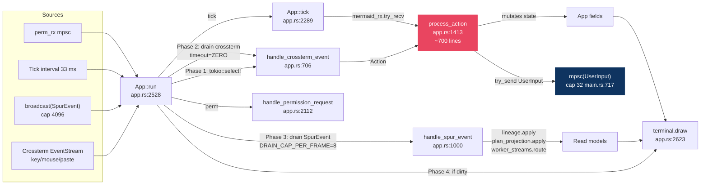

# `spur-tui` — Architecture Review

> **Reviewed 2026-04-27** — supersedes the 2026-04-16 revision.
> **Reviewer panel:** Claude Opus 4.7 (synthesis + risk grounding), kimi (event/state plumbing), gemini (view layer + rendering pipeline).
> **Scope:** `crates/spur-tui/src/` ≈ 14k LoC. **Anchor:** `docs/architecture.md` (grounded 2026-04-26).

---

## 1. Executive Summary

`spur-tui` is the ratatui frontend for the SPUR orchestrator. It is **architecturally sound at the seams** — `ViewContext` cleanly separates event-sourced read models (`ExecutorLineage`, `PlanProjectionStore`) from rendering, and the broadcast / mpsc channel topology matches the canonical `docs/architecture.md` design. It is **architecturally fragile in the middle** — `app.rs` is a 3,655-line god object whose single-threaded event loop, monolithic `process_action` match, and silent backpressure on the upstream `mpsc(UserInput)` channel can soft-lock or silently drop user intent.

Two **HIGH-severity** new defects surfaced (besides the four canonical risks already tracked in `docs/architecture.md` §9): a modal/z-index input-stealing race (gemini), and an O(N) markdown re-parse at streaming framerate (gemini). Two new **HIGH** event-plumbing defects surfaced from kimi: silent `try_send` drop on `mpsc(UserInput)` and the missing `BrainConnectFailed` arm in `LoadState` (this last one re-confirms canonical Risk #26). Refactor urgency: **moderate-to-high** — fix the modal soft-lock and `try_send` drop before next release; the `app.rs` decomposition can wait for v1.0.

---

## 2. Crate Anatomy

| Layer | Modules | Lines | Role |
|---|---|---|---|
| **Entry / harness** | `lib.rs`, `tui.rs`, `landing.rs`, `app.rs` | 3,808 | Crate exports, terminal harness, landing decision, App event loop |
| **Action vocabulary** | `action.rs` | 170 | 32 `Action` variants + `IssueAction` + `PermissionChoice` + `ViewId` |
| **Top-level views** | `views/` (7 files) | 8,060 | dashboard, session_detail, session_picker, plan_inspector, issue_browser, mermaid_viewer + `ViewContext` |
| **Reusable components** | `components/` (~37 files) | ~1.5k each (top files) | InputBar, ReactTrace subsystem, palette, modals, status bar, markdown_stream, completion_popup, picker_shell |
| **Read-model glue** | `worker_streams.rs`, `session_metadata.rs` | 582 | Per-executor `ReactTrace` + per-session metadata cache |
| **Slash + completion** | `commands/` (7 files), `mentions/` (5 files) | 1,604 | 3-tier command merge (spur-local / static / dynamic), pluggable `MentionSource` trait |
| **Agent ingest** | `agents/` (3 files) | – | Config-driven hook system: `prompt_text`, `vendor_exec`, `raw_rest`, `json_path_list`, `acp_available_command`, `system_note` |
| **Misc** | `input_history.rs` | 149 | Input history persistence |

**File-size hot spots** (god-object territory): `app.rs` 3,655 / `views/session_detail.rs` 3,518 / `views/dashboard.rs` 2,185 / `views/session_picker.rs` 1,530.

---

## 3. View Tree & Overlay Stack (gemini)

```mermaid
graph TD
    classDef view fill:#141414,stroke:#363,stroke-width:2px;
    classDef comp fill:#112,stroke:#446;
    classDef overlay fill:#223,stroke:#66a,stroke-width:2px;

    APP[App<br/>app.rs:3655 lines]

    APP -->|Z-1| HO[HelpOverlay]:::overlay
    APP -->|Z-2| QC[QuitConfirmDialog]:::overlay
    APP -->|Z-3| CM[CollisionModal]:::overlay
    APP -->|Z-4| PO[PaletteOverlay]:::overlay

    APP -->|current_view| DASH[DashboardView]:::view
    APP -->|current_view| DETAIL[SessionDetailView]:::view
    APP -->|current_view| PICKER[SessionPickerView]:::view
    APP -->|current_view| PLAN[PlanInspectorView]:::view
    APP -->|current_view| ISSUE[IssueBrowserView]:::view
    APP -->|current_view| MERMAID[MermaidOverlay]:::view

    DASH --> AGT[AgentsTree]:::comp
    DASH --> DP[DetailPane]:::comp
    DASH --> WP[WorkersPanel]:::comp
    DP --> RC[ReviewCard]:::comp
    DP --> RT1[ReactTrace]:::comp

    DETAIL --> RT2[ReactTrace]:::comp
    DETAIL --> IB[InputBar paste-as-atom]:::comp
    DETAIL --> SB[StatusBar]:::comp
    DETAIL --> RB[ResumeBanner]:::comp
    DETAIL --> ICP[InputCompletionPort]:::comp
    ICP --> PS[PickerShell]:::comp
    PS --> CP[CompletionPopup]:::comp
    PS -.->|queries| QS[Slash / Mention / ConfigOption sources]:::comp

    PICKER -.->|owns its own picker state| MD[SessionMetadata store]:::comp
```



**Landing dispatch** (`landing.rs` + `spur-cli`): `LandingDecision::ShowDashboard | ShowPicker { preselect } | AttachExplicit { acp_id, brain }`. CLI injects the initial `UserInput` (e.g., `ResumeSession`) into the upstream mpsc *before* `terminal.draw` — so the first frame already reflects the resolved session.

---

## 4. App Event Loop (kimi)



---

## 5. Per-Frame Draw Cycle (gemini)

```mermaid
sequenceDiagram
    participant Loop as App::run loop
    participant App as App::render
    participant Proj as ExecutorLineage / PlanProjectionStore
    participant Ctx as ViewContext
    participant View as Active view (e.g. SessionDetailView)
    participant Comp as Child components (ReactTrace, InputBar, ...)

    Loop->>App: drained events applied → dirty=true
    Loop->>App: terminal.draw(|frame| app.render(frame))
    App->>Proj: borrow &Lineage, &PlanProjection
    App->>Ctx: ViewContext { lineage, plan_projection, brain_status, license_badge, flag_summary }
    App->>View: view.render(frame, area, &ctx)
    View->>Comp: pass narrowed context / local state
    Comp->>Comp: render to frame buffer
    App->>App: paint overlays (Help → QuitConfirm → Collision → Palette)
```

`ExecutorLineage` and `PlanProjectionStore` are owned directly by `App` — no `Arc<RwLock<…>>`. Concurrency is serialized by the single-task event loop. **Consequence:** any slow operation in `handle_spur_event` or `process_action` blocks the whole frame budget (33 ms).

---

## 6. Architectural Narrative

`spur-tui` is structured around three boundaries that fit `docs/architecture.md` §2 cleanly:

**(a) The ingestion boundary.** `App` subscribes to a `broadcast(SpurEvent)` channel from `spur-core` (capacity 4,096, per architecture.md:268) and drains it in `Phase 3` of each frame, capped at `DRAIN_CAP_PER_FRAME = 8` (`app.rs:2587`). Events are first folded into the read-model projections (`self.lineage.apply`, `self.plan_projection.apply` at `app.rs:1003-1004`), then routed into per-executor `ReactTrace`s (`worker_streams.rs:21`, with an orphan-drop policy at `app.rs:1022`), then forwarded to every active view via `View::handle_spur_event`. There is **no replay-from-NDJSON** on `Lagged` — `Lagged(n)` counts toward the drain cap and the events are gone forever, exactly as canonical Risk #2 / #9 describe.

**(b) The read-model boundary.** Views consume an immutable `ViewContext` constructed each frame (`lib.rs:34-41` shows the test seam: `lineage`, `plan_projection`, `brain_status`, `license_badge`, `flag_summary`). This makes views effectively pure functions of projection state. `DashboardView` is a deliberate exception — `app.rs:2402` calls `dashboard.render_with_lineage(...)` with six disparate arguments instead of a `ViewContext`, leaking the boundary (gemini Risk G5). The `ReactTrace` subsystem (`components/react_trace/`) is the most polished piece of the view layer: it owns its own dispatcher (`dispatch.rs`), ingest builder (`builder.rs`), and a streaming markdown renderer (`markdown_stream.rs`) with a split-state strategy that caches finalized blocks while keeping the tail in an uncommitted buffer for fence detection.

**(c) The action boundary.** User keypresses funnel through `handle_crossterm_event` (`app.rs:706`) with strict modal precedence: quit-confirm → collision modal → help → palette → global chords → active view. The active view returns an `Action` (32 variants in `action.rs`), which `process_action` (`app.rs:1413`, **~700 lines**) routes. For message submits, `SubmitRouter::route` (`commands/submit_router.rs:52`) consults a 3-tier `CommandRegistry` (spur-local meta-commands like `/clear`, `/vim` → static config commands → dynamic ingested commands; collisions documented at `registry.rs:9-14`) and either dispatches a slash command, a vendor-extension RPC, or assembles `Text + ResourceLink` blocks for `Action::SendMessage`. Outbound, `process_action` uses `let _ = tx.try_send(...)` at ~15 sites (e.g., `app.rs:1566, 1642, 1655`) into the upstream `mpsc(UserInput)` channel of capacity **32** (`main.rs:717`). When the orchestrator stalls, user intent is silently dropped — no warn log, no banner. This is **kimi New Risk N1** and is genuinely high-severity for production.

The two parallel state machines close differently. **`BrainStatus`** (`app.rs:104`) is centrally updated in `handle_spur_event` (lines 1135-1291) with explicit arms for `BrainConnectStarted`, `BrainConnected`, `BrainConnectFailed`, `BrainSpawned`, `PromptDispatched`, `AgentMessageChunk`, `TurnFinished`, then 37 explicit `=> {}` no-ops, then a `tracing::debug!` catch-all at `app.rs:1358`. **`LoadState`** (`session_detail.rs:28`) lives inside `SessionDetailView::apply_milestone_event` (lines 346-368) and matches `BrainConnecting`, `SessionLoading`, `SessionLoaded`, `BrainError` — but **not** `BrainConnectFailed`. The result: a failed auto-resume leaves the global status bar at `Error` while the session view spins forever in `Retiring`. This is canonical Risk #26 — confirmed in territory by both kimi and gemini.

The support tier is well-factored. `agents/` provides config-driven hook dispatch (`prompt_text` → submit_router; `vendor_exec` → `VendorExec` action; `raw_rest` → REST template; `json_path_list` / `acp_available_command` → ingest; `system_note` → response render). `mentions/` exposes a pluggable `MentionSource` trait with `WorkerMentionSource` and `FileSource`. `commands/` documents collision rules explicitly (`registry.rs:11-14`): same `(handle, name)` → dynamic wins; cross-handle name collisions surface both with prefix disambiguation. These three subsystems are the closest the crate gets to clean architecture; they should be the model for decomposing `app.rs`.

---

## 7. Risk Register

### A. Canonical risks (re-grounded against territory)

| # | Risk | Status | Evidence |
|---|------|--------|----------|
| **#2** | TUI broadcast drain cap = 8/frame; bot has none; `Lagged` permanently drops events | **CONFIRMED** | `app.rs:2587` `const DRAIN_CAP_PER_FRAME: u32 = 8;`. No NDJSON replay path exists. |
| **#3** | Silent `_ => {}` catch-alls on `SpurEventBody` matches | **CONFIRMED but doc line numbers stale** | Doc cites `app.rs:959,1035`. Actual current locations: `app.rs:919` (crossterm event swallow — `FocusGained`/`FocusLost`), `app.rs:1129` (pre-view SpurEvent fall-through), `app.rs:1358` (37-variant brain-status no-op + debug-only catch-all). |
| **#7** | Orchestrator god-object problem mirrored in `app.rs` | **CONFIRMED, worsening** | `app.rs` is 3,655 lines. Five dominant clusters: event loop / `run` (~115 lines), crossterm dispatch (~190 lines), `handle_spur_event` (~360 lines), `process_action` monolith (~700 lines, `app.rs:1413-2110`), metadata/draft persistence (~200 lines). Test module adds another ~1k. |
| **#26** | `LoadState` deadlock on `BrainConnectFailed` | **CONFIRMED** | `session_detail.rs:346-368`. No `BrainConnectFailed` arm. Closes #26 from territory. |

### B. New risks discovered (this review)

| # | Severity | Source | Risk | Location | Mitigation |
|---|---|---|---|---|---|
| **N1** | **HIGH** | kimi | `try_send(UserInput)` silent drop on `Full`. Upstream cap = 32; ~15 call sites use `let _ = tx.try_send(...)` | `app.rs:1566, 1642, 1655, 1980` (representative); upstream cap at `main.rs:717` | Switch to async `send().await` in a helper, or at minimum match `TrySendError::Full` and surface a transient banner |
| **N2** | MEDIUM | kimi | Unbounded `mermaid_tx` mpsc | `app.rs:315` (`unbounded_channel`), drained at `app.rs:2292` | Replace with bounded(4); drop excess with user-visible "diagram skipped" |
| **N3** | MEDIUM | kimi | `tokio::task::spawn_blocking` for mermaid render is fire-and-forget — no `JoinHandle` stored | `app.rs:2005` | Track handle on `App`; abort on `NavigateBack` / `ClearSession` / shutdown |
| **N4** | MEDIUM | kimi | Orphan `WorkerNotification` permanent drop when executor not yet in lineage | `app.rs:1022` (only `tracing::trace!` logs the drop) | Per-executor LRU orphan buffer in `WorkerStreams`; drain on first `route()` after `ExecutorSpawned` |
| **G1** | **HIGH** | gemini | **Modal/z-index input desync soft-lock**: `quit_confirm_visible` steals input first (`app.rs:710`), but `CollisionModal` paints on top during render (`app.rs:2465-2470`). If both fire simultaneously, user sees collision modal and types into an invisible quit dialog | `app.rs:710, 2465-2470` | Unify into a single `ActiveOverlay` enum on `App` |
| **G2** | **HIGH** | gemini | `MarkdownStream::preview_items()` triggers `flush_final` → `rebuild()`, which rescans `raw_text[..flushed_byte_len]` natively on every frame. At 32k tokens × 30 fps, blocks the main loop | `markdown_stream.rs:330, 555` | Cache parsed-AST tail; restrict `scan_authoritative` from re-running on already-flushed prefixes |
| **G3** | MEDIUM | gemini | `LoadState` has no timeout fallback (compounds Risk #26): even if `BrainConnectFailed` arm is added, `Retiring`/`Loading` can stall on lost messages | `session_detail.rs:346` | Add `last_transition_at: Instant`; on `tick()`, force `LoadState::Failed` after 10 s |
| **G4** | MEDIUM | gemini | Leaked dashboard state across session swap. `Action::ResumeSession` reconstructs `session_detail` but ignores `dashboard.focused_node` / `agents_tree` selection → dangling `ExecutorId` to old workspace | `app.rs:1716` | `dashboard.reset()` in `ResumeSession` and `NewSessionRequested` arms |
| **G5** | LOW | gemini | `ViewContext` boundary leak: `dashboard.render_with_lineage(...)` takes 6 disparate args instead of `&ViewContext` | `app.rs:2402` | Refactor to `dashboard.render(frame, area, &ctx, &mut self.worker_streams)` |
| **G6** | LOW | gemini | `worker_streams.tick_all()` advances every executor's spinner every frame regardless of focus | `app.rs:2385` | Tick only visible-frame executors; or skip spinner advance when no `Pending`/`InProgress` entries are visible |

---

## 8. Prioritized Recommendations

Combined and ranked by impact × ease:

1. **Close the modal soft-lock (G1)** — *days* — Replace `quit_confirm_visible` / `collision_visible` / `palette_visible` boolean trio with `enum ActiveOverlay { None, Help, Quit, Collision, Palette }` on `App`. Single source of truth for both input precedence and z-index. **Highest user-visible win.**

2. **Add `BrainConnectFailed` arm + `LoadState` timeout (Risk #26 + G3)** — *hours* — In `session_detail.rs:346`, transition to `LoadState::Failed { message }` on `BrainConnectFailed`. Add `last_transition_at: Instant`; in `SessionDetailView::tick`, force `Failed` after 10 s in `Retiring`/`Loading`. Closes the only confirmed "infinite spinner" deadlock.

3. **Harden `try_send(UserInput)` against `Full` (N1)** — *days* — Replace every `let _ = tx.try_send(...)` in `process_action` with an async helper that awaits `send()` and surfaces a transient `⚠ queued` banner. Treat the upstream `mpsc(UserInput)` as a hot path, not a fire-and-forget.

4. **Bound `mermaid_tx` and track its `JoinHandle` (N2 + N3)** — *hours* — Bounded(4) channel; store `JoinHandle<()>` on `App`; abort on `NavigateBack` / `ClearSession` / `Drop`. Eliminates both the unbounded growth and the late-completion injection risk.

5. **Incrementalize `MarkdownStream::preview_items` (G2)** — *days* — Cache parsed-AST tail; do not re-scan `raw_text[..flushed_byte_len]` on every preview. This is the single largest CPU win during long agent streams.

6. **Decompose `app.rs` along its five clusters (Risk #7)** — *weeks, post-1.0* — Mirror the canonical `Orchestrator` decomposition pattern (`architecture.md:752`): split `process_action` into `NavigationRouter` + `SessionCommandHandler` + `ReviewDispatcher`; lift `handle_spur_event` brain-status tracking into a `BrainStatusActor`; lift draft/metadata persistence into a `MetadataActor`. Use the `agents/` and `commands/` subsystems as the model.

7. **Audit & enumerate catch-alls (Risk #3)** — *days* — Replace `app.rs:919` with explicit `Event::FocusGained | Event::FocusLost => {}` plus a `debug!` wildcard. In the brain-status match (`app.rs:1358`), use a macro or `static_assertions` so adding a new `SpurEventBody` variant forces an explicit decision.

8. **Buffer orphan `WorkerNotification` (N4)**, **enforce `ViewContext` on `DashboardView` (G5)**, **scope `tick_all` to visible executors (G6)**, **clear dashboard pointers on session swap (G4)** — *each hours* — Bundle these as one cleanup PR.

---

## 9. Verdict

The bones are good. The plumbing follows the canonical channel topology, the read-model boundary is clean (with one leak), and the support tier (`agents/`, `commands/`, `mentions/`) is exemplary. The two HIGH defects worth fixing **before next release** are the modal soft-lock (G1) and the silent `try_send` drop (N1) — both are user-visible and reversible. Risk #7 (`app.rs` god object) is the long-term gravity well; defer the actor decomposition until after v1.0 but stop adding to `app.rs` immediately. Risk #26 / G3 (LoadState deadlock) is a one-line fix that should land this week.
