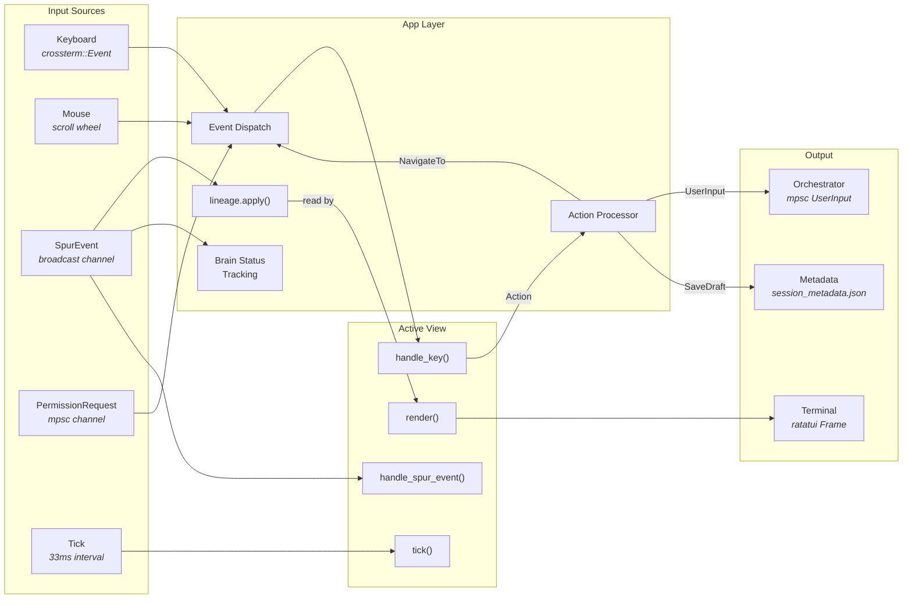
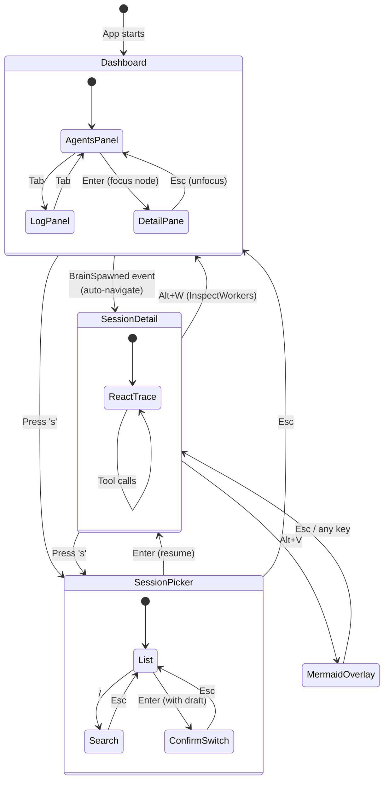

# SPUR TUI Architecture

> Reviewed 2026-04-16. Covers `crates/spur-tui/src/` — 15,247 LOC across 35 source files.
> Sprint 1 (P1: workers panel + diff viewer) and Sprint 2 (P2: incremental render caching) completed.

## 1. Component Map

```mermaid
graph TB
    subgraph APP["App (1688 LOC) — Coordinator"]
        LOOP["Event Loop<br/><i>33ms tick · select!</i>"]
        BRAIN_ST["Brain Status Tracker"]
        META["SessionMetadataStore<br/><i>drafts · pins · archives</i>"]
        LINEAGE["ExecutorLineage<br/><i>event-sourced projection</i>"]
    end

    subgraph VIEWS["Views (4275 LOC)"]
        DASH["DashboardView<br/><i>1120 LOC</i>"]
        SDETAIL["SessionDetailView<br/><i>2049 LOC</i>"]
        PICKER["SessionPickerView<br/><i>1106 LOC</i>"]
        MVIEW["MermaidViewerView<br/><i>123 LOC</i>"]
    end

    subgraph COMPONENTS["Components (7284 LOC)"]
        subgraph HEAVY["Heavy (>300 LOC)"]
            RTRACE["ReactTrace<br/><i>2433 LOC</i>"]
            IBAR["InputBar<br/><i>1038 LOC</i>"]
            MDSTREAM["MarkdownStream<br/><i>736 LOC</i>"]
            TFMT["TraceFormat<br/><i>445 LOC</i>"]
            LWRAP["LineWrap<br/><i>402 LOC</i>"]
            MERMAID["Mermaid<br/><i>346 LOC</i>"]
            DPANE["DetailPane<br/><i>340 LOC</i>"]
            ICARD["InlineExecutorCard<br/><i>313 LOC</i>"]
        end
        subgraph LIGHT["Light (<300 LOC)"]
            ATREE["AgentsTree"]
            ALOG["ActivityLog"]
            SBAR["StatusBar"]
            HELP["HelpOverlay"]
            CPOP["CompletionPopup"]
            RCARD["ReviewCard"]
            QCONF["QuitConfirm"]
            RBANNER["ResumeBanner"]
        end
    end

    subgraph SUPPORT["Support Modules"]
        CMDS["commands/<br/><i>Registry · Router · Fuzzy</i>"]
        AGENTS["agents/<br/><i>Ingest · EntryBuilder</i>"]
        MENTIONS["mentions/<br/><i>Registry · FileSource</i>"]
        ACTIONS["action.rs<br/><i>30+ Action variants</i>"]
    end

    LOOP --> DASH
    LOOP --> SDETAIL
    LOOP --> PICKER
    LOOP --> MVIEW

    DASH --> ATREE
    DASH --> ALOG
    DASH --> DPANE
    DASH --> IBAR
    DASH --> SBAR

    SDETAIL --> RTRACE
    SDETAIL --> IBAR
    SDETAIL --> SBAR
    SDETAIL --> CPOP
    SDETAIL --> RBANNER

    RTRACE --> MDSTREAM
    RTRACE --> TFMT
    RTRACE --> LWRAP
    RTRACE --> MERMAID
    RTRACE --> ICARD

    DPANE --> RCARD

    SDETAIL --> CMDS
    SDETAIL --> MENTIONS
    IBAR --> AGENTS

    style RTRACE fill:#8b0000,stroke:#ff0000,color:#fff
    style SDETAIL fill:#8b0000,stroke:#ff0000,color:#fff
    style APP fill:#1a1a2e,stroke:#e94560,color:#fff
```



### File Size Distribution

| Tier | Files | Total LOC | Concern |
|---|---|---|---|
| God Objects (>1000 LOC) | `react_trace`, `session_detail`, `app`, `dashboard`, `session_picker`, `input_bar` | 9,434 (62%) | Too much in too few files |
| Medium (200–1000 LOC) | 10 files | 4,070 (27%) | Healthy |
| Small (<200 LOC) | 19 files | 1,743 (11%) | Healthy |

---

## 2. Data Flow



### Event Processing Pipeline (per frame)

```
Phase 1: select! — wait for first event (keyboard OR spur event OR tick)
Phase 2: Drain crossterm events (non-blocking, uncapped)
Phase 3: Drain spur events (non-blocking, capped at 64/frame)
Phase 4: Render if dirty
Phase 5: Check quit flag
```

---

## 3. View State Machine



---

## 4. Component Responsibility Matrix

| Component | Renders | Owns State | Handles Keys | Handles Events | LOC |
|---|---|---|---|---|---|
| **App** | Overlays (help, quit) | lineage, brain_status, metadata | Dispatches to views | Brain status, metadata | 1688 |
| **DashboardView** | Tree + log/detail + input | focused_node, panel, text_batch | j/k/Tab/Enter + input | Activity log entries | 1120 |
| **SessionDetailView** | Trace + input + status | 20+ fields | Full keyboard | Session updates, costs | 2049 |
| **SessionPickerView** | Session list + search | filter, cursor, confirm | j/k/Enter/search | SessionsListed | 1106 |
| **ReactTrace** | Markdown + code + mermaid | entries, scroll, virtual_rows | None (delegated) | None (push model) | 2433 |
| **InputBar** | Text + cursor + status | text, cursor, history, mode | Full editing | None | 1038 |
| **DetailPane** | Stream/artifacts/review tabs | current_tab, scroll | Tab cycling | None | 340 |
| **AgentsTree** | Executor tree | selection, collapse | None (delegated) | None | 289 |
| **ActivityLog** | Scrollable log | entries, scroll, following | None (delegated) | None | 140 |

---

## 5. Architectural Assessment

### Strengths

- **Action enum is clean** — 30+ variants provide a well-defined command vocabulary between views and App
- **Component composition works** — Small components (StatusBar, ActivityLog, AgentsTree) have clean interfaces
- **Event-sourced lineage** — Views read from a projection, not raw events. Single source of truth for executor state
- **Persistent metadata** — Drafts, pins, archives survive restarts. Good UX detail
- **macOS Option-key normalization** — Thoughtful cross-platform handling

### Structural Problems

| Problem | Severity | Evidence |
|---|---|---|
| **react_trace.rs is a God Component** | ~~High~~ Fixed | ~~2433 LOC doing markdown, code blocks, mermaid, virtual rows, scroll, trace entries~~ Split into 4 files, max 1087 LOC |
| **session_detail.rs has 20+ public fields** | High | App reaches directly into view state — leaky abstraction |
| **View trait is bypassed** | ~~Medium~~ Fixed | ~~`render_with_lineage`, `handle_key_with_lineage` take extra params outside the trait~~ ViewContext parameter on all trait methods |
| **Triple event handling** | Medium | Every SpurEventBody must be handled in app.rs + dashboard.rs + session_detail.rs |
| **No render caching** | ~~Medium~~ Fixed | ~~Virtual rows and line wrapping recomputed every frame — O(n) per frame~~ Incremental dirty tracking; O(1) amortized during streaming |
| **No component lifecycle** | Low | Views created/destroyed ad-hoc, no mount/unmount hooks |

### UX Gaps

| Gap | Impact | Description |
|---|---|---|
| **No worker visibility from SessionDetail** | ~~**High**~~ Fixed | ~~Brain session view has zero visibility into worker progress. Must switch to Dashboard.~~ Workers panel (Alt+D) + live StatusBar counts |
| **No diff viewer** | ~~**High**~~ Fixed | ~~`ExecutorNode.latest_diff_text` exists but no UI renders it~~ Diff viewer in DetailPane Artifacts tab |
| **Fragmented review workflow** | **Medium** | Review card, worker output, and diff are in different tabs/views |
| **Abrupt view transitions** | **Low** | No breadcrumbs, no back-stack visualization |

---

## 6. Recommendations

### Priority 1: UX Wins (Low Risk) ✅ Completed

**1a. Inline Worker Status in SessionDetail** ✅

Collapsible workers panel between ReactTrace and InputBar showing condensed
one-line-per-worker status for active delegations. Data source: executor IDs
collected from `TraceKind::Delegate` entries, looked up in `ExecutorLineage`.

- `components/workers_panel.rs` — 191 LOC, renders condensed worker rows
- `Alt+D` toggles collapse; hidden when no active workers or terminal < 12 rows
- StatusBar now shows live `running` / `pending_review` counts (was hardcoded 0)
- Reuses `phase_glyph`, `format_elapsed`, `short_id` from `inline_executor_card`

```
┌─ Brain Session ──────────────────────────────────┐
│ ReactTrace (scrollable)                          │
│  ...                                             │
│  ▸ Delegating to claude-code: implement feature  │
│  ...                                             │
├─ Workers (2) ─────────────────── Alt+D collapse ─┤
│ ▶ abcd/claude-code   Running   12s   $0.03       │
│ ⚠ ef01/codex         Review    $0.01  +45/-12    │
├──────────────────────────────────────────────────┤
│ [brain ▸▸▸]  Type a message...                   │
└──────────────────────────────────────────────────┘
```

**1b. Diff Viewer Component** ✅

Unified-diff colorizer rendered in DetailPane's Artifacts tab after the
summary line. Pure function, no state.

- `components/diff_viewer.rs` — 42 LOC, `render_diff_lines(&str) -> Vec<Line>`
- Coloring: `+` green, `-` red, `@@` cyan, `diff`/`---`/`+++` white bold

### Priority 2: Performance (Low Risk) ✅ Completed

**2a. Virtual Row Caching in ReactTrace** ✅

Incremental dirty tracking replaces the binary valid/invalid cache. Only
entries from `dirty_from` onward are rebuilt; the frozen prefix is reused.

- `dirty_from: Cell<Option<usize>>` tracks first dirty entry index
- `entry_row_starts: Vec<usize>` in cache enables O(1) truncation to any entry boundary
- `mark_dirty_from(idx)` coalesces with existing dirty mark via `min()`
- `append_message` / `append_think` → `mark_dirty_from(last)` (was `invalidate_cache`)
- `push` → `mark_dirty_from(len-2)` (handles Act+Observe pairs; full rebuild on eviction)
- `tick` spinner → `mark_dirty_from(spinner_idx)` (was full invalidation)
- `drain_fence_dispatches` → only dirties entries that actually flushed (was unconditional `invalidate_cache` every tick)
- `MarkdownStream::is_dirty()` added to detect flush transitions

| Scenario | Before | After |
|---|---|---|
| Streaming (1000 entries) | O(1000) per frame | O(1) per frame |
| Spinner tick (1000 entries) | O(1000) per 33ms | O(tail) per 33ms |
| New entry pushed | O(n) | O(2) |
| Idle (no changes) | O(1) | O(1) |
| Width change / collapse | O(n) | O(n) |

### Priority 3: Architecture (Medium Risk)

**3a. Decompose react_trace.rs** ✅

Split into focused directory module:

```
components/react_trace/
    types.rs    — TraceKind, TraceEntry, VirtualRow, Segment, RenderContext (85 LOC)
    mod.rs      — ReactTrace struct, data methods, tests (1087 LOC)
    builder.rs  — build_virtual_rows, build_display_lines (811 LOC)
    render.rs   — render, render_with_ctx, cache structs, viewport helpers (507 LOC)
```

No file exceeds 1100 LOC (was 2527 in one file).

**3b. Clean View Trait** ✅

Replaced bypass methods with a context parameter:

```rust
pub struct ViewContext<'a> {
    pub lineage: &'a ExecutorLineage,
    pub brain_status: &'a BrainStatus,
}

pub trait View {
    fn handle_key(&mut self, key: KeyEvent, ctx: &ViewContext) -> Option<Action>;
    fn handle_spur_event(&mut self, event: &SpurEvent, ctx: &ViewContext);
    fn render(&mut self, frame: &mut Frame, area: Rect, ctx: &ViewContext);
    fn tick(&mut self);
}
```

Eliminated `render_with_lineage`, `handle_key_with_lineage`. Views access
lineage and brain status through `ctx` instead of bypass methods. `render`
changed from `&self` to `&mut self` (honest about interior mutation).

**3c. Centralize Event Routing**

Move all SpurEventBody → state updates into the lineage projection. Views read from lineage only, never from raw events. Exception: activity log entries (view-specific formatting).

Eliminates the triple-handling pattern (app + dashboard + session_detail) and the silent-swallow risk.

### Priority 4: UX Polish (Medium Risk)

**4a. Unified Review Experience**

When a review is pending, offer a split view:

```
┌─ Review: claude-code #2 ─────────────────────────┐
│ Left: Diff Viewer          │ Right: Review Card   │
│  src/config.rs             │                      │
│  + pub field: String       │  Summary: Added new  │
│  - // old comment          │  config field...     │
│                            │                      │
│                            │  [a]pprove [d]eny    │
│                            │  [m]odify  [R]etry   │
└──────────────────────────────────────────────────┘
```

### Implementation Order

```
Sprint 1: 1a (inline workers) + 1b (diff viewer)     — ✅ done
Sprint 2: 2a (render caching)                         — ✅ done
Sprint 3: 3a (decompose react_trace)                  — ✅ done
Sprint 4: 3b (clean View trait) + 3c (event routing)  — ✅ 3b done; 3c deferred (ViewContext reduces pain)
Sprint 5: 4a (unified review)                         — UX polish
```
