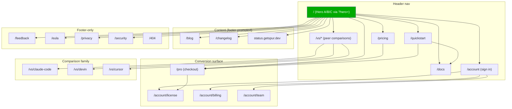
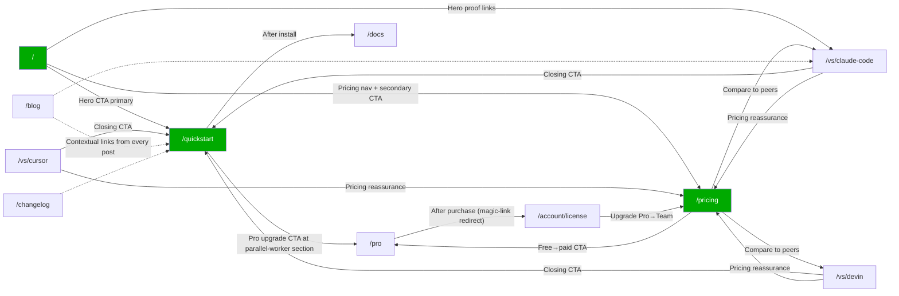

# SPUR Sitemap — Phase-3 Web

*2026-05-20. Phase-3 deliverable (`mkt.web.site-arch`). Built from `marketing/product-marketing.md` V1.3, `marketing/CAMPAIGN_PLAN.md` Phase-3 page list, `marketing/messaging/positioning.md` hero candidates, and `marketing/competitors/_summary-indirect.md`. Designed as a **developer-tool IA**, not a SaaS marketing site — no "Solutions" or "Resources" mega-menus, no GitHub link (no public repo per `product-marketing.md:10`), no "Sign in with GitHub" (signup is email + license per task constraint).*

---

## Strategic IA decisions

1. **Two-zone site, not three.** Marketing (`/`, `/pricing`, `/vs/*`, `/quickstart`) lives at the root. Owner/authenticated surface (`/account`, `/pro` checkout) is a second zone gated by email + license, not a third "app" subdomain. Docs is a third zone but kept on the same domain (see summary §c).
2. **Flat L1 hierarchy.** Every primary page sits one click from `/`. No `/product/...` or `/features/...` parent — the differentiators are the homepage (`product-marketing.md:74-89`); a `/features` index would force readers to click into what should be the hero scroll.
3. **`/vs/*` as the conversion-page family.** Three pages at launch (`/vs/claude-code`, `/vs/devin`, `/vs/cursor`) mapped to the three peers-not-competitors stances in `positioning.md:90-108`. URL stem chosen over `/compare/*` and `/alternatives/*` because `vs` is the search query users actually type ("claude code vs devin").
4. **Hero A/B/C via query param on `/`, not three URLs.** `/`, `/?hero=cost`, `/?hero=tower`, `/?hero=tmux` all serve the same canonical URL (`<link rel="canonical" href="https://getspur.dev/">`) — splitting heroes onto three URLs would dilute SEO equity and break the A/B-measurement plan in `positioning.md:139`. The query param is server-rendered, indexable behaviour unchanged.
5. **No `/login`-style page; account access is a magic-link email.** Signup is email + license (per task), so the auth flow is: enter email on `/account` → emailed magic link → land back on `/account` authenticated. No password page, no OAuth, no `/login` URL. Mirrors how Linear / Resend handle low-friction email auth.
6. **Docs is a placeholder for launch (`/docs` → single landing).** PRD-grade docs aren't ready (`CAMPAIGN_PLAN.md:69` only commits to sitemap+nav at this phase). Ship the URL so install.sh and `spur --help` can link to it; flesh out post-launch.
7. **Blog, changelog, status get mapped but de-emphasized in nav.** Blog is Phase-5 deliverable territory (`CAMPAIGN_PLAN.md:99-101`) — exists at launch as an empty `/blog` index, populates as Phase-5 ships. Changelog and status follow developer-tool convention (Tailscale, Linear, Resend all do this).

---

## Page hierarchy (ASCII tree)

```
Homepage (/)                          ← Hero A default; ?hero=tower, ?hero=tmux variants
├── Pricing (/pricing)
├── Quickstart (/quickstart)          ← curl|sh + first submit_plan, mapped from CAMPAIGN_PLAN.md:67
├── Comparisons
│   ├── /vs/claude-code               ← positioning.md:106-108 stance
│   ├── /vs/devin                     ← positioning.md:94-96 stance
│   └── /vs/cursor                    ← positioning.md:98-100 stance
├── Docs (/docs)                      ← placeholder landing at launch
├── Blog (/blog)                      ← Phase-5 fills this in
├── Changelog (/changelog)
├── Status (status.getspur.dev)       ← separate subdomain; convention for status pages
├── Pro checkout (/pro)               ← Stripe/Paddle checkout per product-marketing.md:209
├── Account (/account)                ← email + license dashboard
│   ├── /account/license
│   ├── /account/billing
│   └── /account/team                 ← Team-tier seats; Pro users see upgrade CTA
├── Feedback (/feedback)              ← `spur feedback` lands here; product-marketing.md:183
├── EULA (/eula)
├── Privacy (/privacy)                ← see summary §a — required, not in original list
├── Security (/security)              ← signed-binary checksums, vulnerability disclosure
└── 404 (/404)                        ← custom; links back to /, /quickstart, /docs
```

`install.sh` is **not a page** — it's an asset served from `https://getspur.dev/install.sh` per `product-marketing.md:204`. Treated as a binary endpoint; mentioned here so it doesn't get accidentally turned into an HTML page.

---

## Visual sitemap (Mermaid)



---

## URL map (table)

| Page | URL | Parent | Nav location | Priority | Notes |
|---|---|---|---|---|---|
| Homepage | `/` | — | Header (logo + nav) | Critical | Hero A default; `?hero=tower` and `?hero=tmux` serve B/C without changing canonical |
| Pricing | `/pricing` | `/` | Header | Critical | Tier table from `product-marketing.md:16-22` |
| Quickstart | `/quickstart` | `/` | Header | Critical | First-run guide; deep-linked from `install.sh` post-install banner |
| `/vs/` index | `/vs` | `/` | Header dropdown label | Medium | Lists the three comparison pages; can be promoted to mini-landing later |
| vs/Claude Code | `/vs/claude-code` | `/vs` | Header dropdown | High | Most-trafficked competitor per VOC corpus (`positioning.md:106`) |
| vs/Devin | `/vs/devin` | `/vs` | Header dropdown | High | Highest-intent search term outside Claude Code |
| vs/Cursor | `/vs/cursor` | `/vs` | Header dropdown | Medium | "Sit next to Cursor" stance per `positioning.md:98-100` |
| Docs (placeholder) | `/docs` | `/` | Header | High | Single landing at launch; flesh out post-Phase-3 |
| Blog index | `/blog` | `/` | Footer | Medium | Empty at launch; Phase-5 fills (`CAMPAIGN_PLAN.md:99-101`) |
| Blog post | `/blog/{slug}` | `/blog` | (none — discoverable from /blog and inline) | Medium | Flat structure, no `/blog/category/` |
| Changelog | `/changelog` | `/` | Footer | Medium | Reverse-chronological; supports `?v=0.x.y` deep-links |
| Status | `status.getspur.dev` | (subdomain) | Footer | Low | Subdomain — convention; lives at status-page vendor (Statuspage / Instatus) |
| Pro checkout | `/pro` | `/` | Pricing CTA only | Critical | Stripe/Paddle checkout; on success → magic-link email + `/account` |
| Account home | `/account` | `/` | Header (right-side, post-auth) | High | Email magic-link gate; no password |
| Account license | `/account/license` | `/account` | Side-nav within /account | High | Download / rotate license key |
| Account billing | `/account/billing` | `/account` | Side-nav within /account | High | Invoices, payment method, plan change |
| Account team | `/account/team` | `/account` | Side-nav within /account | Medium | Team-tier seat mgmt; Pro users see upgrade CTA here |
| Feedback | `/feedback` | `/` | Footer | Medium | Target of `spur feedback` CLI (`product-marketing.md:183`); also a form for non-installers |
| EULA | `/eula` | `/` | Footer | Required | Linked from `install.sh` first-run; binding for Community tier |
| Privacy | `/privacy` | `/` | Footer | **Required (legal)** | Telemetry + email collection + license dashboard = privacy policy mandatory; not in original list — see summary §a |
| Security | `/security` | `/` | Footer | Medium | Signed-binary checksums, Ed25519 policy doc explanation, vuln disclosure email |
| 404 | `/404` | (none) | (none) | Low | Custom; CTA back to `/`, `/quickstart`, `/docs` |

---

## Internal-linking map

Hub-and-spoke is wrong for a small launch site; SPUR uses a **three-hub-three-edge** model:



### Required inbound links per page

| Page | Min inbound from | Rationale |
|---|---|---|
| `/quickstart` | Home hero CTA, every `/vs/*` closing CTA, every blog post sidebar, pricing free-tier row | Top-of-funnel install path; must never be more than one click from anywhere |
| `/pricing` | Header nav, home secondary CTA, every `/vs/*` reassurance block, `/account` upgrade prompts | Conversion page; reassurance density matters |
| `/pro` | Pricing CTA (Pro tier row), in-product `spur upgrade` deeplink (`spur-license/src/upgrade_cta.rs`) | Single canonical checkout entry; no ambient cross-linking |
| `/account/license` | `/pro` purchase redirect, magic-link email, in-product CTA | Post-purchase + ongoing access |
| `/vs/claude-code` | Header dropdown, home hero proof block, blog post #1 ("Why your Claude Code session dies at hour 1") | Highest SEO intent of the three |
| `/eula` | `install.sh` first-run prompt, footer, `/pricing` footnote | Legal — must be visible |
| `/privacy` | Footer, `/account` signup form ("by signing up you agree to..."), `/feedback` form | Legal |
| `/feedback` | Footer, `spur feedback` CLI command target | VOC-collection funnel |
| `/changelog` | Footer, `/docs` sidebar, in-product update banner | Discovery + RSS |

### Cross-section links worth wiring at launch

- `/vs/claude-code` → blog #1 "Why your Claude Code session dies at hour 1 (and what to do about it)" once Phase-5 ships it (`CAMPAIGN_PLAN.md:99`).
- `/pricing` Team-tier row → `/vs/devin` (the Devin-vs-team-of-humans frame is the natural Team-tier objection, `positioning.md:94-96`).
- `/account/team` → `/pricing` Team row (upgrade path).
- Every page footer → `/changelog` (developer-tool convention; reads as "this tool is alive").

### Orphan-page audit (launch state)

No orphans by design. Sanity check at launch: every URL in the table above must be reachable from at least one of {`/`, `/pricing`, `/quickstart`, footer}. Run a crawl post-deploy.

---

## Page-priority weights (for sitemap.xml)

| URL | Priority | Changefreq |
|---|---|---|
| `/` | 1.0 | weekly |
| `/pricing` | 0.9 | monthly |
| `/quickstart` | 0.9 | monthly |
| `/vs/claude-code` | 0.8 | monthly |
| `/vs/devin` | 0.8 | monthly |
| `/vs/cursor` | 0.7 | monthly |
| `/docs` | 0.7 | weekly |
| `/blog` | 0.6 | weekly |
| `/changelog` | 0.6 | weekly |
| `/eula`, `/privacy`, `/security` | 0.3 | yearly |
| `/pro`, `/account/*` | (excluded from sitemap.xml — gated / commerce surface) | — |
| `/feedback`, `/404` | (excluded) | — |

---

## Out-of-scope for this artifact

- Page-by-page copy (covered by `mkt.web.homepage`, `mkt.web.pricing-page`, `mkt.web.vs-*`, `mkt.web.docs-quickstart`).
- Schema/JSON-LD (covered by `mkt.web.schema-jsonld`, `CAMPAIGN_PLAN.md:70`).
- OG images (covered by `mkt.web.og-images`).
- Subdomain choice for docs (recommended in summary §c, but ratification is a separate decision).
